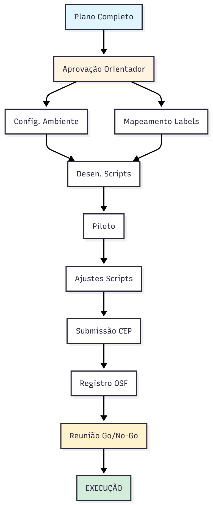

# Análise Comparativa de Manutenibilidade e Tempo de Resolução de Issues: Plataformas Low-Code Open Source vs. Frameworks Web Tradicionais

Estudo empírico comparando a eficiência de manutenção (tempo de resolução de issues) entre Plataformas Low-Code Open Source (e.g., Appsmith, Budibase, ToolJet) e Frameworks Web Tradicionais (e.g., React, Vue.js, NestJS).

# Plano de Experimento – Scoping e Planejamento

## 1. Identificação básica

### 1.1 Título do experimento

Análise Comparativa de Manutenibilidade e Tempo de Resolução de Issues: Plataformas Low-Code Open Source vs. Frameworks Web Tradicionais.

### 1.2 ID / código

`EXP-TCC-2025-LCT` (Low-Code vs Traditional Analysis)

### 1.3 Versão do documento e histórico de revisão

- **v1.0** (21/11/2025): Revisão do plano inicial, definição de hipóteses e escopo de mineração de dados.
- **v1.1** (25/11/2025): Escopo, Objetivo, Stakeholders/Impacto, Riscos de alto nível, premissas e critérios de sucesso
- **v1.2** (28/11/2025): Revisão do plano inicial, definição de hipóteses e escopo de mineração de dados.
- **v1.3** (02/12/2025): População, sujeitos, amostragem, instrumentação, protocolo operacional, plano de análise de dados.
- **v1.4** (05/12/2025): Avaliação de ameaças a validade. Versão final após revisão completa.

### 1.4 Datas (criação, última atualização)

- **Criação:** 21/11/2025
- **Última atualização:** 05/12/2025

### 1.5 Autores (nome, área, contato)

- **Davi José Ferreira:** Estudante de Engenharia de Software - <davi.ferreira.1408962@sga.pucminas.br>

### 1.6 Responsável principal (PI / dono do experimento)

- **Davi José Ferreira:** Pesquisador Principal.

### 1.7 Projeto / produto / iniciativa relacionada

Este experimento compõe o trabalho final de "Proposta de Experimento para TCC" da disciplina de Medição e Experimentação em Engenharia de Software.

---

## 2. Contexto e problema

### 2.1 Descrição do problema / oportunidade

O desenvolvimento Low-Code promete acelerar a entrega de software através de abstração e interfaces visuais. No entanto, existe uma lacuna no entendimento sobre a **manutenibilidade interna** das próprias plataformas que oferecem esses recursos.

O problema investigado é se a complexidade arquitetural e o alto acoplamento inerentes às plataformas Low-Code Open Source resultam em um ciclo de correção de defeitos mais lento em comparação com frameworks web tradicionais baseados em código ("Pro-Code"), que tendem a ser mais modulares. A oportunidade é fornecer evidências empíricas para CTOs e arquitetos sobre a sustentabilidade e agilidade de evolução dessas ferramentas a longo prazo.

### 2.2 Contexto organizacional e técnico

O experimento ocorrerá no contexto de **Software Livre (Open Source)** hospedado no GitHub. O estudo caracteriza-se como **Mineração de Repositórios de Software (MSR)**.

- **Ambiente:** Repositórios públicos de alta relevância (>10k stars).
- **Tecnologias:** Python (para scripts de coleta), GitHub REST API (fonte de dados).
- **Domínio:** Ferramentas de desenvolvimento de software (Developer Tools).

### 2.3 Trabalhos e evidências prévias (internos e externos)

A principal fundamentação para este estudo baseia-se no mapeamento sistemático realizado por **Khorram et al. (2020)**, intitulado _"Problems and opportunities in low-code development"_.

- **Evidência:** Os autores identificaram que a **manutenibilidade** é um dos desafios técnicos mais críticos e citados na adoção de plataformas Low-Code, devido às dificuldades de versionamento e à complexidade oculta gerada pela abstração.
- **Lacuna:** Embora o estudo de Khorram aponte o problema de forma qualitativa através da literatura, há uma escassez de estudos empíricos que quantifiquem essa dificuldade comparando diretamente a **eficiência do processo de manutenção** (_Issue Tracking_) entre os repositórios de plataformas Low-Code e os de frameworks tradicionais.

### 2.4 Referencial teórico e empírico essencial

O desenho experimental fundamenta-se nos seguintes conceitos:

1. **Manutenibilidade (ISO/IEC 25010):** Capacidade do produto de software ser modificado de forma eficaz e eficiente.
2. **Issue Resolution Time (Tempo de Resolução):** Métrica proxy amplamente aceita na indústria e academia para medir esforço de manutenção e complexidade oculta.
3. **Dívida Técnica:** O custo implícito de retrabalho causado pela escolha de uma solução fácil (ou arquiteturalmente complexa) agora, em vez de uma abordagem melhor que levaria mais tempo.
4. **Arquitetura Monolítica vs. Modular:** A premissa teórica de que plataformas Low-Code tendem a ser monólitos acoplados (interface + lógica + dados), dificultando a isolação e correção de falhas.

---

## 3. Objetivos e questões (Goal / Question / Metric)

### 3.1 Objetivo geral (Goal template)

Analisar a **manutenibilidade** (focando em tempo de resolução de issues e esforço de alteração) de **Plataformas Low-Code Open Source** comparadas a **Frameworks Web Tradicionais**, com o propósito de **avaliar a eficiência de manutenção e evolução**, sob a perspectiva de **Arquitetos de Software e Gestores de Tecnologia**, no contexto de **projetos de código aberto hospedados no GitHub**.

### 3.2 Objetivos específicos

- **O1:** Comparar a velocidade de correção de defeitos (bug fixing) entre os dois tipos de tecnologia.
- **O2:** Analisar a complexidade das alterações necessárias para correções (esforço de código).
- **O3:** Avaliar a estabilidade das correções (incidência de reabertura de issues ou regressões).
- **O4:** Investigar o engajamento da comunidade no processo de manutenção (dependência do core team).

### 3.3 Questões de pesquisa e 3.4 Métricas associadas (GQM)

| Objetivo             | Questão de Pesquisa                                                                                                                | Métricas Associadas                                                       |
| :------------------- | :--------------------------------------------------------------------------------------------------------------------------------- | :------------------------------------------------------------------------ |
| **O1. Velocidade**   | **Q1.1** Qual é a diferença no Tempo Médio de Resolução (MTTR) de bugs entre plataformas Low-Code e frameworks tradicionais?       | - MTTR (Mean Time to Resolution)<br>- Issue Age (para issues abertas)     |
|                      | **Q1.2** A distribuição do tempo de fechamento de issues varia significativamente entre os grupos (cauda longa de bugs complexos)? | - Issue Close Time Percentiles (P50, P90, P99)<br>- Std Dev of Close Time |
|                      | **Q1.3** Qual é o tempo mediano de vida de um bug crítico?                                                                         | - Critical Bug Resolution Time<br>- Critical Bug Count                    |
| **O2. Esforço**      | **Q2.1** Qual é o tamanho médio dos commits (churn) associados a correções de bugs em cada grupo?                                  | - Code Churn (Lines Added + Deleted)<br>- Commit Count per Issue          |
|                      | **Q2.2** Quantos arquivos são modificados em média para resolver uma issue (dispersão da mudança)?                                 | - Files Changed Count<br>- Directory Spread (pastas afetadas)             |
|                      | **Q2.3** O tamanho do patch (linhas adicionadas/removidas) difere significativamente entre os grupos?                              | - Patch Size (Bytes)<br>- Hunks Count                                     |
| **O3. Estabilidade** | **Q3.1** Qual a taxa de reabertura de issues (bugs que voltaram)?                                                                  | - Reopen Rate<br>- Reopen Count                                           |
|                      | **Q3.2** Qual a proporção de issues marcadas como "wontfix" ou "invalid"?                                                          | - Invalid Issue Rate<br>- Wontfix Issue Rate                              |
|                      | **Q3.3** Qual a frequência de issues linkadas a commits de "revert"?                                                               | - Revert Commit Rate<br>- Regression Label Count                          |
| **O4. Comunidade**   | **Q4.1** Qual o tempo médio para a primeira resposta da equipe/comunidade em uma nova issue?                                       | - Time to First Response<br>- Time to First Triage                        |
|                      | **Q4.2** Qual a proporção de issues resolvidas por contribuidores externos vs. time core?                                          | - External Contributor Ratio<br>- Core Team Commit Ratio                  |
|                      | **Q4.3** Qual o número médio de participantes na discussão de um bug?                                                              | - Comment Count<br>- Unique Commenters Count                              |

### Tabela de Definição de Métricas

| Métrica                            | Descrição                                                                                           | Unidade                |
| :--------------------------------- | :-------------------------------------------------------------------------------------------------- | :--------------------- |
| **MTTR (Mean Time to Resolution)** | Tempo médio decorrido entre a abertura e o fechamento de uma issue classificada como bug.           | Horas / Dias           |
| **Issue Age**                      | Tempo decorrido desde a abertura até o momento atual para issues ainda abertas.                     | Dias                   |
| **Issue Close Time Percentiles**   | Valores de tempo de fechamento abaixo dos quais se encontram 50%, 90% e 99% das observações.        | Dias                   |
| **Std Dev of Close Time**          | Desvio padrão do tempo de fechamento, indicando a variabilidade do processo de correção.            | Dias                   |
| **Critical Bug Resolution Time**   | Tempo de resolução específico para issues com labels de alta prioridade (e.g., `critical`, `high`). | Horas                  |
| **Code Churn**                     | Soma de linhas de código adicionadas e removidas nos commits associados à issue.                    | Linhas de Código (LOC) |
| **Commit Count per Issue**         | Número total de commits vinculados a uma única issue.                                               | Quantidade (Inteiro)   |
| **Files Changed Count**            | Número de arquivos únicos modificados nos commits da issue.                                         | Quantidade (Inteiro)   |
| **Directory Spread**               | Número de diretórios distintos que contêm arquivos modificados na correção.                         | Quantidade (Inteiro)   |
| **Patch Size**                     | Tamanho total em bytes do diff gerado pela correção.                                                | Bytes                  |
| **Reopen Rate**                    | Porcentagem de issues que foram reabertas após terem sido fechadas.                                 | Porcentagem (%)        |
| **Invalid Issue Rate**             | Porcentagem de issues fechadas com labels indicando inválido (`invalid`, `duplicate`).              | Porcentagem (%)        |
| **Revert Commit Rate**             | Porcentagem de correções que resultaram em um commit posterior de reversão (`revert`).              | Porcentagem (%)        |
| **Time to First Response**         | Tempo decorrido entre a abertura da issue e o primeiro comentário de um membro (não autor).         | Horas                  |
| **External Contributor Ratio**     | Proporção de issues resolvidas (PR mergeado) por usuários que não são mantenedores do repositório.  | Porcentagem (%)        |
| **Comment Count**                  | Número total de comentários na thread da issue.                                                     | Quantidade (Inteiro)   |
| **Unique Commenters Count**        | Número de usuários distintos que participaram da discussão da issue.                                | Quantidade (Inteiro)   |

---

## 4. Escopo e contexto do experimento

### 4.1 Escopo funcional / de processo (incluído e excluído)

- **Incluído:**
  - Análise de issues fechadas e commits associados (via link na issue) em repositórios públicos do GitHub.
  - Foco estrito em issues classificadas semanticamente como "bug", "fix" ou "defect" através de labels ou mineração de texto no título.
  - Repositórios com mais de 10.000 estrelas para garantir relevância e maturidade de processo.
- **Excluído:**
  - Issues de "feature request", "enhancement", documentação ou dúvidas (questions).
  - Repositórios privados ou plataformas Low-Code proprietárias (sem acesso ao código fonte).
  - Análise de qualidade de código estática (SonarQube) não está no escopo principal deste estudo de _processo_, mas sim a métrica de _tempo e esforço_.

### 4.2 Contexto do estudo (tipo de organização, projeto, experiência)

- **Tipo de Organização:** Projetos Open Source mantidos majoritariamente por empresas comerciais (e.g., Appsmith Inc., Vercel, Facebook/Meta) com forte apoio da comunidade.
- **Tipo de Projeto:** Ferramentas de desenvolvimento de software (Developer Tools), caracterizadas por alta complexidade técnica.
- **Perfil de Experiência:** Desenvolvedores profissionais, mantenedores core e contribuidores open source distribuídos globalmente.

### 4.3 Premissas

- As issues estão corretamente etiquetadas (labels como `bug`, `fix`, `type:bug`) nos repositórios selecionados, permitindo a filtragem automática.
- O link entre issues e Pull Requests/Commits é rastreável na maioria dos casos (via "Closing keywords" do GitHub).
- A API do GitHub permanecerá estável e acessível durante o período de coleta de dados.

### 4.4 Restrições

- **Limitação de API:** O GitHub impõe um limite de 5.000 requisições por hora para usuários autenticados, o que pode prolongar o tempo de coleta.
- **Tempo:** O experimento deve ser concluído dentro do semestre letivo.
- **Acesso:** Impossibilidade de entrevistar os desenvolvedores para entender o contexto qualitativo de cada bug ("caixa preta").

### 4.5 Limitações previstas

- **Viés de seleção:** Os repositórios escolhidos podem não representar todo o universo Low-Code/Tradicional, limitando a generalização (validade externa).
- **Qualidade dos dados:** Issues podem ter sido fechadas sem correção real, ou correções feitas sem link explícito, gerando ruído nos dados.

---

## 5. Stakeholders e impacto esperado

### 5.1 Stakeholders principais

- **CTOs e Decisores de Tecnologia:** Responsáveis pela escolha de stack tecnológica em empresas.
- **Arquitetos de Software:** Interessados na manutenibilidade arquitetural e dívida técnica de longo prazo.
- **Equipes de Desenvolvimento:** Interessados em saber se a ferramenta facilita ou dificulta o dia a dia de correções.
- **Pesquisadores de Engenharia de Software:** Interesse na validação empírica de métricas de manutenção em novos paradigmas de desenvolvimento.

### 5.2 Interesses e expectativas dos stakeholders

- **Decisores:** Esperam dados quantitativos para justificar o ROI e avaliar o risco de "lock-in" de manutenção difícil a longo prazo com Low-Code.
- **Arquitetos:** Buscam evidências de que a abstração do Low-Code não cobra um preço alto demais em complexidade de manutenção.
- **Pesquisador:** Espera identificar padrões distintos de evolução entre os dois paradigmas e publicar os resultados.

### 5.3 Impactos potenciais no processo / produto

- **No Experimento:** A execução é passiva (mineração de dados históricos), portanto não há impacto direto nos produtos ou equipes analisadas.
- **Pós-Experimento:** Os resultados podem influenciar diretrizes de adoção de Low-Code na indústria, potencialmente desencorajando o uso para sistemas críticos se a manutenibilidade for comprovadamente pior, ou validando a tecnologia caso seja equivalente/melhor.

---

## 6. Riscos de alto nível, premissas e critérios de sucesso

### 6.1 Riscos de alto nível (negócio, técnicos, etc.)

- **Risco Técnico (Médio):** Dificuldade em normalizar dados entre repositórios com processos diferentes (ex: taxonomias de labels inconsistentes).
  - _Mitigação:_ Criar um mapa de equivalência de labels para cada repositório antes da análise.
- **Risco de Dados (Alto):** Baixa quantidade de links explícitos entre Issue e Commit em alguns projetos, reduzindo a amostra para métricas de esforço (churn).
  - _Mitigação:_ Utilizar heurísticas de busca textual em mensagens de commit (e.g., "fixes #123") se os links diretos forem escassos.

### 6.2 Critérios de sucesso globais (go / no-go)

- Coleta de pelo menos **1.000 issues válidas** (classificadas como bug e fechadas) de cada grupo (Low-Code vs Tradicional).
- Capacidade de responder a pelo menos **80% das Questões de Pesquisa** com significância estatística (p-value < 0.05).
- Análise de **3 repositórios Low-Code** e **3 repositórios Tradicionais** (total de 6 repositórios).

### 6.3 Critérios de parada antecipada (pré-execução)

- Se, durante a análise exploratória inicial, for identificado que menos de **10% das issues** possuem links rastreáveis para commits/PRs, a análise de "esforço de código" (Objetivo O2) será abortada ou reescopada, mantendo-se apenas a análise temporal (Objetivo O1), pois a mineração manual seria inviável pelo tempo disponível.

---

## 7. Modelo conceitual e hipóteses

### 7.1 Modelo conceitual do experimento

O modelo conceitual baseia-se na premissa de que a **Complexidade Acidental** introduzida pelas camadas de abstração das plataformas Low-Code impacta negativamente a manutenibilidade interna do projeto.

- **Fator (Causa):** Tipo de Tecnologia (Low-Code vs Framework Tradicional).
- **Mecanismo:** Plataformas Low-Code tendem a ter arquiteturas mais acopladas e bases de código maiores/mais complexas para sustentar a generacidade dos editores visuais.
- **Efeito (Resposta):** Aumento no tempo necessário para diagnosticar e corrigir defeitos (MTTR) e maior esforço de código (Churn) para correções similares.

**Esquema:**
`Tecnologia Low-Code` -> `Maior Abstração/Acoplamento` -> `Maior Dificuldade de Debugging` -> `Maior MTTR`

### 7.2 Hipóteses formais (H0, H1)

**Para O1 (Velocidade - MTTR):**

- **H0_1:** Não há diferença significativa no Tempo Médio de Resolução de bugs entre plataformas Low-Code e Frameworks Tradicionais. ($MTTR_{LC} = MTTR_{Trad}$)
- **H1_1:** O Tempo Médio de Resolução de bugs em plataformas Low-Code é maior do que em Frameworks Tradicionais. ($MTTR_{LC} > MTTR_{Trad}$)

**Para O2 (Esforço - Code Churn):**

- **H0_2:** Não há diferença significativa no tamanho médio dos commits de correção entre os grupos. ($Churn_{LC} = Churn_{Trad}$)
- **H1_2:** As correções em plataformas Low-Code exigem maior alteração de código (maior Churn) devido à complexidade interna. ($Churn_{LC} > Churn_{Trad}$)

### 7.3 Nível de significância e considerações de poder

- **Nível de Significância ($\alpha$):** 0,05 (5%).
- **Poder Estatístico ($1 - \beta$):** Espera-se um poder alto (> 0.80) dado o tamanho planejado da amostra.
- **Tamanho da Amostra:** Com a meta de 1.000 issues por grupo, o estudo terá sensibilidade suficiente para detectar até mesmo tamanhos de efeito pequenos (Cohen's d ~ 0.2) usando testes não-paramétricos (Mann-Whitney U), que são adequados para distribuições de tempo de resolução (geralmente não-normais).

---

## 8. Variáveis, fatores, tratamentos e objetos de estudo

### 8.1 Objetos de estudo

Os objetos de estudo são as **Issues** (classificadas como bugs) fechadas nos repositórios selecionados e seus respectivos **Pull Requests/Commits** de correção.

### 8.2 Sujeitos / participantes (visão geral)

Neste estudo de Mineração de Repositórios de Software (MSR), não há recrutamento direto de participantes humanos. Os "sujeitos" indiretos são os desenvolvedores (core team e contribuidores) que atuaram na resolução das issues analisadas.

### 8.3 Variáveis independentes (fatores) e seus níveis

- **Fator Principal:** Tipo de Plataforma de Desenvolvimento.
- **Níveis:**
    1. Plataformas Low-Code Open Source.
    2. Frameworks Web Tradicionais.

### 8.4 Tratamentos (condições experimentais)

- **Tratamento A (Grupo Experimental):** Conjunto de issues extraídas de repositórios Low-Code (e.g., Appsmith, ToolJet).
- **Tratamento B (Grupo Controle/Comparação):** Conjunto de issues extraídas de repositórios de Frameworks Tradicionais (e.g., React, Vue).

### 8.5 Variáveis dependentes (respostas)

As variáveis dependentes são as métricas definidas na seção GQM, focando em:

1. **Tempo:** MTTR, Issue Age.
2. **Esforço:** Code Churn, Files Changed.
3. **Estabilidade:** Reopen Rate.

### 8.6 Variáveis de controle / bloqueio

Para mitigar vieses, os seguintes critérios são mantidos constantes (controle):

- **Domínio:** Ferramentas de desenvolvimento (DevTools).
- **Popularidade:** Repositórios com > 10k stars.
- **Linguagem Principal:** Ecossistema JavaScript/TypeScript.
- **Período:** Issues fechadas nos últimos 24 meses (para garantir relevância atual).

### 8.7 Possíveis variáveis de confusão conhecidas

- **Tamanho da Comunidade:** Projetos maiores (ex: React) têm mais gente para fixar bugs, mas também mais bugs reportados.
- **Rigor do Processo:** Alguns projetos exigem testes complexos antes do merge, aumentando o tempo artificialmente.
- **Complexidade do Bug:** Um bug "crítico" no Low-Code pode ser intrinsecamente mais difícil que um bug "crítico" no React devido à natureza do software.

### Tabela de Variáveis

| Tipo             | Variável           | Descrição                                           | Escala  |
| :--------------- | :----------------- | :-------------------------------------------------- | :------ |
| **Independente** | Tipo de Plataforma | Categoria do repositório (Low-Code ou Tradicional). | Nominal |
| **Dependente**   | MTTR               | Tempo em horas da abertura ao fechamento da issue.  | Razão   |
| **Dependente**   | Code Churn         | Soma de linhas adicionadas e removidas na correção. | Razão   |
| **Dependente**   | Files Changed      | Número de arquivos alterados.                       | Razão   |
| **Controle**     | Linguagem          | Linguagem predominante do repositório (TS/JS).      | Nominal |
| **Controle**     | Popularidade       | Número de estrelas do repositório (>10k).           | Ordinal |

### Tabela de Fatores e Tratamentos

| Fator          | Nível 1 (Tratamento A)                                    | Nível 2 (Tratamento B)                                       |
| :------------- | :-------------------------------------------------------- | :----------------------------------------------------------- |
| **Tecnologia** | **Low-Code Open Source**<br>(Appsmith, Budibase, ToolJet) | **Framework Web Tradicional**<br>(React, Vue, Svelte/NestJS) |

---

## 9. Desenho experimental

### 9.1 Tipo de desenho

Será utilizado um **Desenho Quase-Experimental (Quasi-Experiment)**, especificamente um estudo comparativo ex-post-facto.

- **Justificativa:** Não é possível randomizar bugs para serem "Low-Code" ou "Tradicionais", nem randomizar desenvolvedores. Analisamos dados históricos que já ocorreram.

### 9.2 Randomization e alocação

- **Seleção de Repositórios:** Seleção intencional (Purposive Sampling) baseada em critérios de popularidade e relevância para garantir comparabilidade.
- **Seleção de Issues (Processo em duas etapas):**
    1. **Coleta Exaustiva:** Mineração de **TODAS as issues fechadas** classificadas como bugs nos últimos 24 meses (janela temporal: Jan/2024 - Dez/2025).
    2. **Subamostragem Condicional:**
        - Se **N ≤ 1.000** por grupo: Utilizar todas as issues coletadas.
        - Se **1.000 < N ≤ 100.000** total: Utilizar todas as issues coletadas (máximo de ~50k por grupo).
        - Se **N > 100.000** total: Aplicar **Amostragem Aleatória Simples** para selecionar 1.000 issues por grupo, estratificada por repositório.

### 9.3 Balanceamento e contrabalanço

- **Balanceamento:** Serão analisados **3 repositórios Low-Code** e **3 repositórios Tradicionais** (total: 6 repositórios). Buscaremos balancear o tamanho da amostra final (N=1000 para cada lado) através de subamostragem se um grupo for muito maior que o outro.
- **Contrabalanço:** Não se aplica, pois não há sessões repetidas com os mesmos sujeitos realizando tarefas em ordens diferentes.

### 9.4 Número de grupos e sessões

- **Grupos:** 2 grupos independentes (Low-Code e Tradicional).
- **Sessões:** Não se aplica a estudo de mineração de dados (coleta única).

---

## 10. População, sujeitos e amostragem

### 10.1 População-alvo

A população-alvo deste estudo é composta por **Issues de manutenção corretiva (bugs)** e seus respectivos artefatos de resolução (Pull Requests e Commits) em projetos de software Open Source de alta relevância no ecossistema de desenvolvimento web moderno.

- **Unidade de Análise:** A "Issue" (relatório de defeito) resolvida.

### 10.2 Critérios de inclusão de sujeitos (Issues/Repositórios)

Para serem incluídos na amostra, os repositórios e issues devem atender aos seguintes critérios:

- **Repositórios:**
  - Estar hospedado publicamente no GitHub.
  - Possuir mais de 1.000 estrelas (indicativo de relevância e comunidade ativa).
  - Ter o inglês como idioma principal de comunicação.
  - Pertencer inequivocamente a uma das categorias: Plataforma Low-Code ou Framework Web.
- **Issues:**
  - Estar no estado `Closed`.
  - Possuir label explícita de `bug`, `defect`, `fix` ou similar (conforme mapeamento).
  - Ter sido fechada nos últimos 24 meses (janela de relevância temporal).

### 10.3 Critérios de exclusão de sujeitos

Serão excluídos da análise:

- Issues fechadas sem resolução (labels `wontfix`, `duplicate`, `invalid`, `question`).
- Issues que não possuem link rastreável para um Commit ou Pull Request (impossibilitando a medição de esforço de código).
- Issues criadas e fechadas por bots automatizados (ex: dependabot), pois distorcem o MTTR humano.
- Repositórios que não utilizam o Issue Tracking do GitHub (ex: usam Jira externo sem integração visível).

### 10.4 Tamanho da amostra planejado (por grupo)

- **Meta Mínima:** 1.000 issues válidas por grupo (2.000 total).
- **Meta Ideal:** Todas as issues disponíveis nos últimos 24 meses, até o limite de 50.000 por grupo.
- **Estratégia:**
  - **Cenário 1 (Baixo volume):** Se houver < 1.000 issues por grupo → Usar todas disponíveis e revisar viabilidade.
  - **Cenário 2 (Volume adequado):** Se houver 1.000 a 50.000 issues por grupo → Usar todas (análise full-scale).
  - **Cenário 3 (Volume excessivo):** Se houver > 100.000 issues total → Subamostragem aleatória para 1.000 por grupo.
- **Justificativa:** O tamanho mínimo de 1.000 issues por grupo fornece poder estatístico suficiente (>0.80) para detectar tamanhos de efeito pequenos a médios. Amostras maiores aumentam a sensibilidade e reduzem o erro padrão.

### 10.5 Método de seleção / recrutamento

- **Seleção de Repositórios:** Amostragem Intencional (Purposive Sampling). Os repositórios serão escolhidos manualmente para garantir que representem os líderes de mercado em cada categoria.
- **Seleção de Issues:**
  - **Fase 1 - Coleta Total:** Mineração automatizada **exaustiva** de todas as issues fechadas classificadas como bugs dentro da janela temporal de 24 meses (usando filtros da API do GitHub: `is:issue is:closed label:bug closed:2024-01-01..2025-12-31`).
  - **Fase 2 - Decisão de Amostragem:** Após coleta, avaliar o volume total:
    - **Usar tudo** se N < 100.000 total (ideal para maximizar poder estatístico).
    - **Aplicar amostragem aleatória estratificada** se N > 100.000 total, selecionando 1.000 issues por grupo proporcionalmente distribuídas entre os 3 repositórios de cada categoria.

### 10.6 Repositórios-alvo selecionados

**Plataformas Low-Code Open Source (3 repositórios):**

1. **Appsmith** (`appsmithorg/appsmith`) - >30k stars
2. **Budibase** (`Budibase/budibase`) - >20k stars
3. **ToolJet** (`ToolJet/ToolJet`) - >25k stars

**Frameworks Web Tradicionais (3 repositórios):**

1. **React** (`facebook/react`) - >220k stars
2. **Vue.js** (`vuejs/core`) - >45k stars
3. **NestJS** (`nestjs/nest`) - >65k stars

**Justificativa da Seleção:**

- Todos os repositórios possuem mais de 10.000 estrelas, garantindo maturidade e relevância.
- Pertencem ao ecossistema JavaScript/TypeScript, mantendo a linguagem como variável de controle.
- Representam líderes de mercado em suas respectivas categorias.
- Possuem processos estabelecidos de Issue Tracking no GitHub.

### 10.7 Treinamento e preparação dos sujeitos

Como este é um estudo de MSR (Mineração de Repositórios) _ex-post-facto_, não há interação com participantes humanos. O "treinamento" refere-se à validação e calibração dos scripts de coleta pelo pesquisador para garantir a consistência dos dados extraídos.

---

## 11. Instrumentação e protocolo operacional

### 11.1 Instrumentos de coleta

- **Scripts de Mineração (Python):** Scripts desenvolvidos especificamente para o experimento utilizando a biblioteca `PyGithub`.
- **GitHub REST API v3:** Fonte primária dos dados brutos.
- **Jupyter Notebooks:** Ambiente para execução da limpeza, processamento e análise estatística dos dados.
- **Planilhas/CSV:** Formato de armazenamento intermediário para auditoria manual dos dados coletados.

### 11.2 Materiais de suporte

- **Dicionário de Labels:** Um documento mapeando as diferentes tags usadas em cada repositório (ex: `type: bug` no Repo A = `bug` no Repo B) para garantir a normalização.
- **Guia de Auditoria:** Protocolo para verificação manual de uma amostra aleatória de 5% dos dados para garantir que os scripts estão capturando as informações corretas (Validação de Ground Truth).

### 11.3 Procedimento experimental (Fluxograma)

O fluxograma abaixo detalha o passo a passo da operacionalização do experimento, desde a seleção até a análise.


**Passo a Passo Detalhado:**

1. **Configuração:** Preparação do ambiente Python e tokens de acesso ao GitHub.
2. **Mapeamento:** Inspeção manual dos repositórios alvo para identificar quais labels correspondem a bugs.
3. **Coleta Bruta:** Execução do script para baixar todas as issues fechadas nos últimos 24 meses.
4. **Filtragem:** Aplicação dos critérios de inclusão/exclusão (labels, bots).
5. **Enriquecimento:** Para cada issue válida, o script busca o PR ou Commit que a fechou para extrair dados de esforço (linhas alteradas).
6. **Sanitização:** Remoção de dados inconsistentes (ex: datas de fechamento anteriores à abertura).
7. **Análise:** Execução dos testes estatísticos comparando os grupos.

### 11.4 Plano de piloto

Será realizado um estudo piloto com **1 repositório de cada grupo** (ex: Appsmith vs React) coletando apenas **50 issues** de cada.

- **Objetivo:** Validar se os scripts de coleta estão funcionando corretamente, se o mapeamento de labels é eficaz e se a API do GitHub impõe bloqueios não previstos.
- **Ajuste:** Se a taxa de issues sem link para commit for > 50%, o critério de busca de links será refinado (ex: buscar no corpo dos comentários e não apenas nos eventos de fechamento).

---

## 12. Plano de análise de dados (pré-execução)

### 12.1 Estratégia geral de análise

A análise será comparativa, focada em contrastar as distribuições das métricas entre os dois grupos independentes (Low-Code vs Tradicional). O objetivo é rejeitar ou falhar em rejeitar as hipóteses nulas formuladas na seção 7.

### 12.2 Métodos estatísticos planejados

Dada a natureza das métricas de engenharia de software (geralmente assimétricas e com cauda longa), a preferência será por métodos não-paramétricos:

1. **Estatística Descritiva:**
    - Cálculo de Média, Mediana, Desvio Padrão, Mínimo, Máximo, Quartis (25%, 75%).
    - Visualização através de **Boxplots** (para ver dispersão e outliers) e **Violin Plots** (para ver densidade).
2. **Testes de Hipótese:**
    - **Mann-Whitney U Test:** Para comparar as medianas de MTTR e Churn entre os dois grupos (assumindo que os dados não seguem distribuição normal).
    - **Cliff’s Delta:** Para medir o tamanho do efeito (magnitude da diferença) de forma não-paramétrica.
3. **Correlação (Secundária):**
    - **Spearman Rank Correlation:** Para investigar se há correlação entre o tamanho do churn e o tempo de resolução dentro de cada grupo.

### 12.3 Tratamento de dados faltantes e outliers

- **Dados Faltantes:** Issues que não possuem data de fechamento ou data de criação válidas serão excluídas. Issues sem dados de commit (churn) serão excluídas apenas das análises de esforço (O2), mas mantidas nas análises de tempo (O1).
- **Outliers:**
  - Valores extremos (ex: issues abertas por 5 anos) são comuns em software e representam casos reais. Eles **não serão removidos** a menos que sejam erros de dados óbvios (ex: data negativa).
  - Para mitigar o impacto de outliers na análise, o foco principal será na **Mediana** e não na Média.

### 12.4 Plano de análise para dados qualitativos

Embora o estudo seja quantitativo, será realizada uma **análise qualitativa leve** nos outliers extremos (top 5 issues mais demoradas de cada grupo).

- **Técnica:** Leitura manual da thread da issue.
- **Objetivo:** Identificar categorias de motivos para a demora (ex: "dificuldade técnica", "falta de prioridade", "aguardando reprodução"). Isso ajudará a discutir os resultados e fornecer contexto para os números.

---

## 13. Avaliação de validade (ameaças e mitigação)

### 13.1 Validade de conclusão

Refere-se à capacidade de tirar conclusões estatísticas corretas sobre as relações entre as variáveis.

- **Baixo Poder Estatístico:** O risco de não detectar um efeito existente.
  - _Mitigação:_ O tamanho da amostra planejado (N=1.000 por grupo) é suficientemente grande para garantir um poder > 0.80 para tamanhos de efeito pequenos/médios.
- **Violação de Suposições de Testes:** O uso de testes paramétricos (como t-test) em dados que não seguem distribuição normal (comum em métricas de tempo).
  - _Mitigação:_ Uso planejado de testes não-paramétricos (Mann-Whitney U) e estatísticas robustas (Mediana, Cliff's Delta) que não assumem normalidade.
- **Confiabilidade das Medidas:** Erros nos scripts de coleta podem gerar dados ruidosos.
  - _Mitigação:_ Validação manual (auditoria) de uma subamostra aleatória (5%) para garantir que o script está extraindo o "tempo de resolução" e "churn" corretamente.

### 13.2 Validade interna

Refere-se à certeza de que o fator de tratamento (Low-Code vs Tradicional) causou o efeito observado, e não outros fatores.

- **Viés de Seleção (Selection Bias):** Os repositórios escolhidos podem ter processos de manutenção naturalmente diferentes (ex: um projeto pode ser mais rigoroso com Code Review, demorando mais).
  - _Mitigação:_ Seleção de projetos maduros (>10k stars) em ambos os grupos para tentar equalizar o nível de maturidade do processo.
- **Variáveis de Confusão (Confounding):** O tamanho da comunidade pode influenciar o tempo de resposta. Projetos como React têm milhares de olhos, enquanto Low-Code tem menos.
  - _Mitigação:_ Monitorar a métrica "Time to First Response" (O4) para distinguir se a demora é por falta de gente (comunidade) ou dificuldade técnica (manutenibilidade).
- **História (History):** Eventos externos durante a janela de 24 meses (ex: lançamento de uma versão major bugada) podem distorcer a média.
  - _Mitigação:_ A janela de tempo longa (2 anos) e a análise de múltiplos repositórios ajudam a diluir o impacto de eventos pontuais.

### 13.3 Validade de constructo

Refere-se à adequação das métricas operacionais para representar os conceitos teóricos.

- **Mono-operation Bias:** Usar apenas "Tempo de Resolução" como proxy único para "Manutenibilidade". O tempo pode ser afetado por burocracia, não apenas pela dificuldade do código.
  - _Mitigação:_ Triangulação com métricas de esforço (Code Churn, Files Changed) e taxa de reabertura (Reopen Rate) para ter uma visão multidimensional da dificuldade de manutenção.
- **Definição do Constructo "Bug":** O que é considerado bug pode variar entre projetos (alguns usam label `bug` para melhorias pequenas).
  - _Mitigação:_ Mapeamento manual rigoroso das labels de cada repositório e exclusão de labels ambíguas.

### 13.4 Validade externa

Refere-se à capacidade de generalizar os resultados para outros contextos.

- **Generalização para Low-Code Proprietário:** O estudo foca em Low-Code _Open Source_. Os resultados podem não se aplicar a ferramentas fechadas (Mendix, OutSystems) que têm arquiteturas diferentes.
  - _Mitigação:_ Deixar claro no relatório que as conclusões se limitam ao ecossistema Open Source e arquiteturas transparentes.
- **Generalização para outras linguagens:** O estudo foca no ecossistema JavaScript/TypeScript.
  - _Mitigação:_ Reconhecer esta limitação; resultados podem variar para plataformas baseadas em Java ou .NET.

### 13.5 Resumo das principais ameaças e estratégias de mitigação

| Tipo de Validade | Ameaça Principal                                         | Estratégia de Mitigação                                                                         |
| :--------------- | :------------------------------------------------------- | :---------------------------------------------------------------------------------------------- |
| **Conclusão**    | Distribuição não-normal dos dados de tempo.              | Uso de testes estatísticos não-paramétricos (Mann-Whitney U).                                   |
| **Interna**      | Diferença no tamanho da comunidade (fator de confusão).  | Controle via métrica "Time to First Response" e seleção de projetos populares.                  |
| **Constructo**   | "Tempo" incluir burocracia e não só dificuldade técnica. | Triangulação com métricas de código (Churn, Files Changed).                                     |
| **Externa**      | Resultados restritos ao Open Source.                     | Delimitação explícita do escopo e sugestão de trabalhos futuros para ferramentas proprietárias. |

---

## 14. Ética, privacidade e conformidade

### 14.1 Questões éticas (uso de sujeitos, incentivos, etc.)

Este estudo caracteriza-se como **Mineração de Repositórios de Software (MSR)** utilizando dados públicos disponíveis no GitHub, portanto não envolve interação direta com participantes humanos. No entanto, algumas considerações éticas são pertinentes:

- **Uso de Dados Públicos:** Embora os dados sejam públicos, os desenvolvedores não consentiram explicitamente para análise acadêmica. O estudo respeitará os Termos de Serviço do GitHub e utilizará apenas informações acessíveis publicamente.
- **Atribuição e Reconhecimento:** Os repositórios analisados serão citados adequadamente no relatório final, reconhecendo o trabalho das comunidades de desenvolvimento.
- **Não Identificação Individual:** O foco do estudo são métricas agregadas por tipo de tecnologia, não o desempenho de desenvolvedores individuais. Nomes de usuários serão anonimizados na apresentação dos resultados.
- **Ausência de Incentivos:** Não há recrutamento, intervenção ou oferecimento de incentivos, eliminando questões de coerção ou conflito de interesse.
- **Riscos Mínimos:** O estudo não expõe os participantes (desenvolvedores) a qualquer risco adicional, pois não há coleta de dados sensíveis além do que já está disponível publicamente.

### 14.2 Consentimento informado

Dado que este é um estudo observacional de dados públicos secundários:

- **Dispensa de Consentimento Explícito:** Por se tratar de análise de dados publicamente disponíveis no GitHub (plataforma que opera sob licenças de código aberto), não é aplicável o processo tradicional de consentimento informado individual.
- **Consentimento Implícito pela Publicação:** Ao publicar código e issues em repositórios públicos sob licenças Open Source, os desenvolvedores consentem implicitamente que suas contribuições sejam visíveis e analisáveis pela comunidade.
- **Transparência da Pesquisa:** O plano de experimento e os resultados serão publicados de forma aberta, permitindo que qualquer membro das comunidades analisadas tome conhecimento do estudo e solicite esclarecimentos ou exclusão de dados específicos, se aplicável.
- **Conformidade com Políticas do GitHub:** O estudo seguirá rigorosamente os [Termos de Serviço do GitHub](https://docs.github.com/en/site-policy/github-terms/github-terms-of-service) e as [Políticas de Uso Aceitável](https://docs.github.com/en/site-policy/acceptable-use-policies/github-acceptable-use-policies), particularmente quanto ao uso da API.

### 14.3 Privacidade e proteção de dados

Embora os dados sejam públicos, medidas de privacidade serão adotadas:

- **Dados Coletados:**
  - Metadados de Issues: Número da issue, título, labels, datas de criação/fechamento, estado.
  - Metadados de Commits/PRs: SHA do commit, mensagem, autor (username público), linhas adicionadas/removidas, arquivos alterados.
  - **Não serão coletados:** E-mails privados, endereços IP, informações de perfil além do username público.
- **Anonimização:**
  - Na base de dados de análise, os usernames dos desenvolvedores serão **pseudoanonimizados** (substituídos por IDs genéricos como `DEV001`, `DEV002`).
  - Apenas o tipo de contribuidor (Core Team vs. External) será mantido para análise do Objetivo O4.
- **Controle de Acesso:**
  - A base de dados bruta será armazenada localmente no computador do pesquisador com criptografia de disco (BitLocker/FileVault).
  - Acesso restrito ao pesquisador principal e orientador acadêmico (mediante autorização).
- **Retenção de Dados:**
  - Dados brutos serão mantidos por **2 anos** após a conclusão do estudo para permitir auditoria e replicação.
  - Após esse período, os dados identificáveis serão deletados permanentemente, mantendo-se apenas datasets agregados e anonimizados.
- **Conformidade com LGPD/GDPR:**
  - Como os dados são públicos e não há identificação de informações sensíveis, o estudo está em conformidade com a Lei Geral de Proteção de Dados (LGPD - Brasil) e GDPR (Europa), que permitem o processamento de dados públicos para fins de pesquisa científica.

### 14.4 Aprovações necessárias (comitê de ética, jurídico, DPO, etc.)

- **Comitê de Ética em Pesquisa (CEP):**
  - **Status:** Dispensa prevista pela Resolução CNS 510/2016 (Brasil), que exclui de avaliação ética pesquisas que utilizem informações de acesso público nos termos da Lei nº 12.527/2011 (Lei de Acesso à Informação).
  - **Ação:** Consulta formal ao CEP da instituição (PUC Minas) será realizada para confirmar a dispensa. Caso seja exigida submissão via Plataforma Brasil, o protocolo será registrado.
- **Orientador Acadêmico:**
  - **Status:** Aprovação pendente do professor orientador sobre o plano de experimento completo.
  - **Prazo:** Até 10/12/2025.
- **Departamento Jurídico / DPO:**
  - **Status:** Não aplicável, pois o estudo não coleta dados sensíveis nem é financiado por terceiros.
- **GitHub / Termos de API:**
  - **Status:** Conformidade verificada. O uso da API seguirá os limites de taxa (5.000 req/hora) e as políticas de scraping ético do GitHub.
- **Registro Pré-Publicação:**
  - O protocolo do experimento será registrado publicamente no **Open Science Framework (OSF)** antes do início da coleta de dados, promovendo transparência e prevenindo HARKing (Hypothesizing After Results are Known).

---

## 15. Recursos, infraestrutura e orçamento

### 15.1 Recursos humanos e papéis

- **Davi José Ferreira** (Pesquisador Principal)
  - **Papel:** Responsável pelo planejamento, execução, coleta de dados, análise estatística, redação do relatório e defesa do TCC.
- **Prof. Danilo de Quadros Maia Filho** (Orientador Acadêmico)
  - **Papel:** Revisão crítica do desenho experimental, validação metodológica, orientação na análise de dados e aprovação dos entregáveis.

### 15.2 Infraestrutura técnica necessária

- **Ambiente de Desenvolvimento:**
  - **Computador Pessoal:** Notebook com 16GB RAM, processador i7 (ou equivalente), sistema operacional Windows/Linux/macOS.
  - **Python 3.10+:** Ambiente de execução para scripts de coleta e análise.
  - **Jupyter Notebook / JupyterLab:** Interface para análise interativa e documentação do código.
- **Ferramentas e Bibliotecas:**
  - **PyGithub:** Biblioteca Python para acesso à API REST do GitHub.
  - **Pandas, NumPy:** Manipulação e limpeza de dados.
  - **Matplotlib, Seaborn:** Visualização de dados (gráficos estatísticos).
  - **SciPy, Statsmodels:** Testes estatísticos e análise inferencial.
  - **Git / GitHub:** Controle de versão dos scripts e versionamento do plano.
- **Armazenamento:**
  - **GitHub (Repositório Privado):** Versionamento do código, plano e notebooks.
  - **Google Drive / OneDrive:** Backup dos dados brutos e resultados intermediários (com criptografia).
- **Acesso a APIs:**
  - **GitHub Personal Access Token (PAT):** Necessário para autenticação na API e aumento do limite de requisições (5.000/hora).
  - **Endpoint:** `https://api.github.com/` (REST API v3).

### 15.3 Materiais e insumos

- **Licenças de Software:**
  - Todas as ferramentas utilizadas são Open Source ou possuem versões gratuitas (Python, Jupyter, bibliotecas científicas), portanto **sem custo de licenciamento**.
- **Acesso à Internet:**
  - Conexão estável para coleta contínua de dados via API do GitHub.
- **Documentação de Referência:**
  - Acesso a artigos científicos via Portal de Periódicos CAPES (disponível gratuitamente para alunos da PUC Minas).
- **Templates e Formulários:**
  - Dicionário de Labels (criado manualmente).
  - Guia de Auditoria de Dados (checklist em formato Markdown).
  - Template de Jupyter Notebook para análise padronizada.

### 15.4 Orçamento e custos estimados

| Item                      | Descrição                                 | Quantidade | Custo Unitário | Custo Total   |
| :------------------------ | :---------------------------------------- | :--------- | :------------- | :------------ |
| **Recursos Humanos**      | Horas do Pesquisador Principal            | R$ 0,00    | R$ 0,00\*      | R$ 0,00       |
| **Infraestrutura**        | Computador pessoal (já disponível)        | 1          | R$ 0,00        | R$ 0,00       |
| **Software**              | Licenças (todas Open Source / gratuitas)  | -          | R$ 0,00        | R$ 0,00       |
| **Internet**              | Acesso durante 3 meses (já incluído)      | 3 meses    | R$ 0,00        | R$ 0,00       |
| **Armazenamento Cloud**   | Google Drive (15GB gratuito suficiente)   | -          | R$ 0,00        | R$ 0,00       |
| **Publicação (Opcional)** | Taxa de inscrição em conferência (futuro) | -          | R$ 0,00\*\*    | R$ 0,00       |
| **TOTAL ESTIMADO**        |                                           |            |                | **R$ 0,00\*** |

**Fonte de Financiamento:** Recursos próprios do pesquisador (autofinanciamento). Não há financiamento externo ou bolsa de pesquisa vinculada.

---

## 16. Cronograma, marcos e riscos operacionais

### 16.1 Macrocronograma (até o início da execução)

| Fase                | Atividade                                | Responsável | Início     | Fim        | Duração   | Marco                    |
| :------------------ | :--------------------------------------- | :---------- | :--------- | :--------- | :-------- | :----------------------- |
| **1. Planejamento** | Elaboração do Plano de Experimento       | Davi        | 21/11/2025 | 05/12/2025 | 2 semanas | Plano v1.3 concluído  |
|                     | Revisão pelo Orientador                  | Orientador  | 06/12/2025 | 10/12/2025 | 1 semana  | Aprovação do Plano    |
| **2. Preparação**   | Configuração do ambiente Python e API    | Davi        | 09/12/2025 | 11/12/2025 | 3 dias    | Ambiente pronto       |
|                     | Mapeamento de repositórios e labels      | Davi        | 12/12/2025 | 15/12/2025 | 4 dias    | Dicionário de Labels  |
|                     | Desenvolvimento de scripts de coleta     | Davi        | 16/12/2025 | 20/12/2025 | 5 dias    | Scripts versão alfa   |
| **3. Piloto**       | Execução do estudo piloto (2 repos)      | Davi        | 21/12/2025 | 23/12/2025 | 3 dias    | 🧪 Piloto executado      |
|                     | Análise dos dados do piloto e ajustes    | Davi        | 26/12/2025 | 28/12/2025 | 3 dias    | Scripts validados     |
| **4. Pré-Execução** | Submissão ao CEP (se necessário)         | Davi        | 06/01/2026 | 10/01/2026 | 1 semana  | Protocolo registrado  |
|                     | Registro no OSF (Open Science Framework) | Davi        | 13/01/2026 | 14/01/2026 | 1 dia     | Pré-registro público  |
|                     | Reunião final de go/no-go                | Equipe      | 15/01/2026 | 15/01/2026 | 1 dia     | 🚀 **Início autorizado** |
| **5. Execução**     | Coleta de dados (full-scale)             | Davi        | 16/01/2026 | 30/01/2026 | 2 semanas | -                        |

**Marcos Críticos:**

- **05/12/2025:** Conclusão da versão final do plano de experimento (este documento).
- **10/12/2025:** Aprovação formal do orientador (go/no-go para seguir).
- **28/12/2025:** Scripts validados e prontos para coleta em larga escala.
- **15/01/2026:** Checklist de prontidão aprovado (Definition of Ready).
- **16/01/2026:** **Início da operação de coleta de dados.**

### 16.2 Dependências entre atividades

O diagrama de dependências (precedência) é o seguinte:



**Dependências Críticas:**

- O **desenvolvimento dos scripts** depende da conclusão do **mapeamento de labels**, pois é necessário saber quais tags buscar em cada repositório.
- O **piloto** só pode ser executado após os **scripts estarem funcionais**.
- A **execução full-scale** só pode iniciar após a **validação bem-sucedida do piloto** e a **aprovação final (go/no-go)**.
- A **submissão ao CEP** (se necessária) pode ocorrer em paralelo com o desenvolvimento técnico, mas é um requisito para o início da execução.

### 16.3 Riscos operacionais e plano de contingência

| Risco                                          | Probabilidade | Impacto | Gatilho                                                  | Contingência                                                                                                        |
| :--------------------------------------------- | :------------ | :------ | :------------------------------------------------------- | :------------------------------------------------------------------------------------------------------------------ |
| **Atraso na aprovação do orientador**          | Média         | Alto    | Orientador não responde até 10/12.                       | Agendar reunião presencial urgente; reduzir escopo temporariamente para acelerar revisão.                           |
| **Bloqueio da API do GitHub (rate limit)**     | Baixa         | Médio   | Script atinge 5.000 requisições e é bloqueado.           | Implementar throttling automático; distribuir coleta em múltiplos dias; usar múltiplos tokens (se ético).           |
| **Qualidade dos dados do piloto insuficiente** | Média         | Alto    | Menos de 50% das issues têm links para commits.          | Refinar heurística de busca textual (regex em mensagens de commit); reduzir métricas de O2 (esforço) se necessário. |
| **Falha no equipamento (HD corrompido)**       | Baixa         | Alto    | Computador apresenta falha durante coleta.               | Backup automático diário para cloud (Google Drive); scripts salvam progresso incremental (checkpoints).             |
| **Indisponibilidade da API do GitHub**         | Baixa         | Médio   | GitHub tem downtime prolongado (>24h).                   | Postergar coleta até normalização; usar cache local de dados já coletados.                                          |
| **Falta de tempo para análise estatística**    | Média         | Médio   | Coleta consome mais tempo que previsto.                  | Priorizar análise das hipóteses H1 (MTTR) e H2 (Churn); adiar análise de O3 e O4 para trabalhos futuros.            |
| **Repositório-alvo muda política de issues**   | Baixa         | Baixo   | Um repositório fecha issues antigas ou oculta histórico. | Substituir por repositório equivalente; recalcular amostra mínima se necessário.                                    |

**Plano de Monitoramento:**

- Reuniões semanais com o orientador para verificar progresso e riscos emergentes.
- Log diário de atividades do pesquisador (time tracking) para identificar gargalos cedo.

---

## 17. Governança do experimento

### 17.1 Papéis e responsabilidades formais

Utilizando a matriz RACI (Responsible, Accountable, Consulted, Informed):

| Atividade                      | Pesquisador Principal | Orientador | CEP (se aplic.) | Especialista Estatística |
| :----------------------------- | :-------------------- | :--------- | :-------------- | :----------------------- |
| **Elaboração do Plano**        | R, A                  | C          | I               | -                        |
| **Aprovação do Plano**         | R                     | A          | -               | -                        |
| **Desenvolvimento de Scripts** | R, A                  | I          | -               | -                        |
| **Execução do Piloto**         | R, A                  | C          | -               | -                        |
| **Análise de Dados**           | R, A                  | C          | -               | C                        |
| **Submissão ao CEP**           | R, A                  | C          | A               | -                        |
| **Decisão Go/No-Go**           | R                     | A          | -               | -                        |
| **Redação do Relatório Final** | R, A                  | C          | -               | -                        |
| **Defesa do TCC**              | R, A                  | C          | -               | -                        |

**Legenda:**

- **R (Responsible):** Quem executa a tarefa.
- **A (Accountable):** Quem aprova e é o responsável final (apenas 1 por atividade).
- **C (Consulted):** Quem deve ser consultado (opiniões bidirecionais).
- **I (Informed):** Quem deve ser informado (comunicação unidirecional).

### 17.2 Ritos de acompanhamento pré-execução

- **Reunião Semanal de Orientação:**
  - **Frequência:** Toda sexta-feira às 14h (ou conforme disponibilidade do orientador).
  - **Duração:** 1 hora.
  - **Participantes:** Pesquisador Principal e Orientador.
  - **Pauta:** Revisão do progresso da semana, discussão de bloqueios, validação de decisões técnicas, planejamento da próxima semana.
  - **Formato:** Presencial ou videoconferência (Google Meet/Teams).
- **Checkpoint Pós-Piloto:**
  - **Data:** 28/12/2025.
  - **Objetivo:** Análise crítica dos resultados do piloto, decisão sobre ajustes nos scripts ou no escopo.
  - **Participantes:** Pesquisador Principal, Orientador e (opcionalmente) Especialista em Estatística.
- **Reunião Go/No-Go:**
  - **Data:** 15/01/2026.
  - **Objetivo:** Validação final de que todos os critérios de prontidão foram atendidos (Seção 20).
  - **Decisão:** Autorizar (Go) ou adiar (No-Go) o início da coleta full-scale.
  - **Participantes:** Pesquisador Principal e Orientador.

### 17.3 Processo de controle de mudanças no plano

Qualquer alteração no desenho experimental, hipóteses, métricas ou cronograma deve seguir o seguinte fluxo:

1. **Identificação:** Pesquisador identifica necessidade de mudança (ex: descoberta de viés no piloto).
2. **Proposta:** Pesquisador documenta a mudança proposta em um relatório de mudança (Change Request) contendo:
    - Descrição da mudança.
    - Justificativa (por que é necessária).
    - Impacto (no cronograma, validade, recursos).
    - Alternativas consideradas.
3. **Revisão:** Orientador revisa a proposta em até 48 horas.
4. **Aprovação:** Orientador aprova, rejeita ou solicita revisão.
5. **Implementação:** Pesquisador implementa a mudança aprovada.
6. **Versionamento:** O plano de experimento é atualizado com uma nova versão (ex: v1.4) e o histórico de revisão é atualizado na seção 1.3.
7. **Comunicação:** Mudanças significativas são comunicadas ao CEP (se aplicável) e registradas no OSF.

**Mudanças que NÃO exigem aprovação formal:**

- Ajustes cosméticos no código (refatoração).
- Adição de visualizações adicionais na análise exploratória.
- Correção de erros tipográficos no plano.

**Mudanças que EXIGEM aprovação formal:**

- Alteração nas hipóteses H0/H1.
- Mudança nos repositórios-alvo.
- Adição/remoção de métricas principais.
- Alteração no critério de inclusão/exclusão de issues.

---

## 18. Plano de documentação e reprodutibilidade

### 18.1 Repositórios e convenções de nomeação

- **Repositório Principal (GitHub):**
  - **Nome:** `comparative-analysis-maintainability-lowcode-vs-traditional-frameworks`
  - **Visibilidade:** Privado durante a execução; será tornado público após a defesa do TCC.
  - **Estrutura de Pastas:**

        ```
        /
        ├── README.md (este plano de experimento)
        ├── docs/
        │   ├── ethics/ (documentos de aprovação ética, se aplicável)
        │   ├── references/ (PDFs de artigos relevantes)
        │   └── templates/ (formulários, checklists)
        ├── scripts/
        │   ├── collection/ (scripts de coleta de dados)
        │   ├── preprocessing/ (limpeza e transformação)
        │   └── analysis/ (notebooks de análise estatística)
        ├── data/
        │   ├── raw/ (dados brutos da API, CSV)
        │   ├── processed/ (dados limpos e anonimizados)
        │   └── results/ (outputs de análise, gráficos)
        ├── notebooks/
        │   ├── 01_exploratory_analysis.ipynb
        │   ├── 02_hypothesis_testing.ipynb
        │   └── 03_visualizations.ipynb
        └── reports/ (relatórios intermediários e finais)
        ```

- **Convenção de Nomeação de Arquivos:**
  - Scripts Python: `snake_case` (ex: `collect_issues.py`, `calculate_mttr.py`).
  - Notebooks: Numeração sequencial + descrição (ex: `01_exploratory_analysis.ipynb`).
  - Dados CSV: `repositorio_tipo_data.csv` (ex: `appsmith_issues_2025-12-05.csv`).
  - Versionamento do Plano: `README_v1.X.md` (manteremos histórico de versões em commits Git).

### 18.2 Templates e artefatos padrão

- **Dicionário de Labels (Template):**
  - Localização: `docs/templates/label_mapping_template.csv`
  - Conteúdo: Planilha com colunas `[Repositório, Label Original, Label Normalizada, Categoria]`.
  - Exemplo:

        | Repositório | Label Original | Label Normalizada | Categoria |
        | :--- | :--- | :--- | :--- |
        | appsmithorg/appsmith | `Bug` | `bug` | Defeito |
        | facebook/react | `Type: Bug` | `bug` | Defeito |

- **Guia de Auditoria de Dados (Checklist):**
  - Localização: `docs/templates/data_audit_checklist.md`
  - Conteúdo: Lista de verificação para validar manualmente uma amostra de 5% dos dados coletados (ex: "Data de fechamento é posterior à data de abertura?", "Commit SHA é válido?").
- **Template de Jupyter Notebook:**
  - Localização: `notebooks/00_template.ipynb`
  - Conteúdo: Estrutura padrão com seções:
        1. Importação de bibliotecas.
        2. Carregamento de dados.
        3. Análise exploratória.
        4. Testes estatísticos.
        5. Visualizações.
        6. Conclusões.
- **Formulário de Controle de Mudanças (Change Request):**
  - Localização: `docs/templates/change_request_template.md`
  - Conteúdo: Template com campos para descrever mudanças propostas no plano.

### 18.3 Plano de empacotamento para replicação futura

Para facilitar a replicação do experimento por outros pesquisadores:

- **Pacote de Replicação (Research Compendium):**
  - Após a conclusão do estudo, será criado um arquivo compactado (`replication_package.zip`) contendo:
    - **Plano completo** (este documento em PDF).
    - **Scripts de coleta e análise** (totalmente comentados).
    - **Dados anonimizados** (CSV processado, sem usernames identificáveis).
    - **Notebooks executados** (com outputs visíveis).
    - **Arquivo de dependências** (`requirements.txt` para Python).
    - **Instruções de execução** (`REPLICATION_GUIDE.md`) com passo a passo detalhado.
- **Ambiente Docker (Opcional):**
  - Se viável, será criada uma imagem Docker com todas as dependências instaladas, permitindo execução com um único comando (`docker run ...`).
- **Publicação em Repositório de Dados:**
  - Os dados anonimizados e scripts serão depositados no **Zenodo** (repositório de dados científicos) com um DOI persistente para citação.
- **Licença Open Source:**
  - Todo o código será liberado sob licença **MIT License** (permissiva).
  - O plano e documentos serão liberados sob **Creative Commons BY 4.0** (CC-BY 4.0), permitindo uso com atribuição.

---

## 19. Plano de comunicação

### 19.1 Públicos e mensagens-chave pré-execução

| Público                        | Interesse                                    | Mensagem-Chave                                                                                                   | Timing                       |
| :----------------------------- | :------------------------------------------- | :--------------------------------------------------------------------------------------------------------------- | :--------------------------- |
| **Orientador Acadêmico**       | Garantir qualidade metodológica e progresso. | "Plano aprovado, piloto validado, execução no prazo."                                                            | Semanal (reuniões)           |
| **Banca Examinadora (Futuro)** | Avaliar rigor científico e contribuição.     | "Experimento bem fundamentado, com validade interna e externa explicitadas."                                     | Na defesa (Mar/2026)         |
| **Comunidades Open Source**    | Transparência sobre o estudo.                | "Estamos analisando métricas agregadas de manutenibilidade para pesquisa acadêmica, respeitando dados públicos." | Pós-coleta (Fev/2026)        |
| **Colegas de Curso**           | Compartilhar aprendizados.                   | "Estudo comparativo entre Low-Code e Tradicional usando MSR, resultados preliminares promissores."               | Seminário interno (Jan/2026) |
| **Comitê de Ética**            | Conformidade ética.                          | "Estudo de dados públicos, sem riscos aos participantes, em conformidade com CNS 510/2016."                      | Na submissão (Jan/2026)      |

### 19.2 Canais e frequência de comunicação

- **Orientador:**
  - **Canal:** Reuniões presenciais/online (Google Meet) + E-mail para dúvidas pontuais.
  - **Frequência:** Semanal (sextas-feiras) + comunicação ad-hoc conforme necessidade.
- **Comitê de Ética (CEP):**
  - **Canal:** Plataforma Brasil (sistema oficial de submissão).
  - **Frequência:** Submissão única + respostas a pareceres se solicitado.
- **Comunidades Open Source (Opcional):**
  - **Canal:** Issues públicas nos repositórios analisados (após a coleta) ou e-mail direto aos mantenedores.
  - **Frequência:** Comunicação única pós-coleta para informar sobre o estudo e oferecer compartilhamento dos resultados.
- **Público Acadêmico:**
  - **Canal:** Registro no Open Science Framework (OSF) + possível publicação em conferência (SBES, MSR Workshop).
  - **Frequência:** Pré-registro antes da execução + publicação dos resultados pós-defesa.

### 19.3 Pontos de comunicação obrigatórios

Os seguintes eventos exigem comunicação formal e documentada:

1. **Aprovação do Plano de Experimento (10/12/2025):**
    - Comunicar ao orientador via e-mail formal com anexo do plano completo em PDF.
    - Aguardar resposta por escrito (e-mail ou parecer assinado) antes de prosseguir.
2. **Início da Coleta de Dados (16/01/2026):**
    - Enviar e-mail ao orientador informando oficialmente o início da operação.
    - Registrar data e hora no log do experimento.
3. **Mudanças Significativas no Plano:**
    - Qualquer alteração nas hipóteses, métricas principais ou repositórios exige aprovação documentada do orientador.
    - Se já submetido ao CEP, comunicar mudanças via emenda ao protocolo.
4. **Conclusão da Coleta de Dados (30/01/2026):**
    - Enviar relatório executivo ao orientador com estatísticas descritivas básicas da amostra coletada.
5. **Incidentes ou Desvios:**
    - Qualquer problema grave (ex: perda de dados, descoberta de viés crítico) deve ser comunicado ao orientador em até 24 horas.
6. **Defesa do TCC (Março/2026):**
    - Notificação formal à banca examinadora com pelo menos 15 dias de antecedência (conforme regras da instituição).

---

## 20. Critérios de prontidão para execução (Definition of Ready)

### 20.1 Checklist de prontidão (itens que devem estar completos)

Antes de iniciar a coleta de dados em larga escala (full-scale), **TODOS** os itens abaixo devem estar marcados como Completos:

| Item                         | Descrição                                                                              | Status      | Responsável       | Prazo      |
| :--------------------------- | :------------------------------------------------------------------------------------- | :---------- | :---------------- | :--------- |
| **1. Plano Aprovado**        | Plano de Experimento revisado e aprovado formalmente pelo orientador.                  | Pendente | Orientador        | 10/12/2025 |
| **2. Repositórios Mapeados** | Lista definitiva dos 6 repositórios (3 Low-Code + 3 Tradicionais) documentada.         | Pendente | Davi              | 15/12/2025 |
| **3. Dicionário de Labels**  | Mapeamento completo de labels para cada repositório criado e validado.                 | Pendente | Davi              | 15/12/2025 |
| **4. Ambiente Configurado**  | Python, bibliotecas, Jupyter e GitHub PAT configurados e testados.                     | Pendente | Davi              | 11/12/2025 |
| **5. Scripts Desenvolvidos** | Scripts de coleta, limpeza e cálculo de métricas funcionais (versão alfa).             | Pendente | Davi              | 20/12/2025 |
| **6. Piloto Executado**      | Estudo piloto (2 repos, 50 issues cada) realizado com sucesso.                         | Pendente | Davi              | 23/12/2025 |
| **7. Piloto Validado**       | Análise dos dados do piloto confirmou viabilidade e qualidade (>50% issues com links). | Pendente | Davi              | 28/12/2025 |
| **8. Scripts Ajustados**     | Correções e otimizações implementadas com base no feedback do piloto.                  | Pendente | Davi              | 28/12/2025 |
| **9. Conformidade Ética**    | Submissão ao CEP realizada (se aplicável) ou dispensa formalmente confirmada.          | Pendente | Davi              | 10/01/2026 |
| **10. Pré-registro Público** | Protocolo do experimento registrado no Open Science Framework (OSF) com timestamp.     | Pendente | Davi              | 14/01/2026 |
| **11. Backup Configurado**   | Sistema de backup automático para cloud (Google Drive) testado e ativo.                | Pendente | Davi              | 11/12/2025 |
| **12. Templates Prontos**    | Todos os templates (notebooks, checklists) criados e versionados no repositório.       | Pendente | Davi              | 20/12/2025 |
| **13. Comunicação Feita**    | Stakeholders relevantes (orientador, CEP) informados sobre cronograma e escopo.        | Pendente | Davi              | 15/01/2026 |
| **14. Reunião Go/No-Go**     | Reunião final de validação realizada com decisão formal de "Go".                       | Pendente | Orientador + Davi | 15/01/2026 |

**Critério de Aceitação Global:** O experimento só poderá iniciar se **100% dos itens** acima estiverem marcados como Completos.

### 20.2 Aprovações finais para iniciar a operação

- **Aprovação Técnica:**
  - **Responsável:** Pesquisador Principal (Davi José Ferreira).
  - **Critério:** Todos os itens técnicos (4, 5, 6, 7, 8, 11, 12) validados e documentados no log de atividades.
  - **Registro:** Commit no repositório Git com tag `v1.0-ready-to-execute`.
- **Aprovação Metodológica:**
  - **Responsável:** Orientador Acadêmico.
  - **Critério:** Revisão do plano completo, validação dos resultados do piloto e confirmação de que o desenho experimental está sólido.
  - **Registro:** E-mail formal do orientador com a frase: _"Autorizo o início da coleta de dados conforme o plano aprovado."_
- **Aprovação Ética:**
  - **Responsável:** CEP (se aplicável) ou Orientador (se dispensa confirmada).
  - **Critério:** Protocolo aprovado ou confirmação formal de dispensa.
  - **Registro:** Documento PDF do parecer do CEP ou declaração assinada de dispensa.
- **Go/No-Go Final:**
  - **Data:** 15/01/2026 (reunião presencial ou videoconferência).
  - **Participantes:** Davi (Pesquisador) e Orientador.
  - **Decisão:** Após revisão do checklist:
    - **Go:** Se todos os itens estiverem, a coleta é autorizada para iniciar em 16/01/2026.
    - **No-Go:** Se algum item crítico estiver pendente, a execução é postergada até resolução, com nova data de reunião definida.
  - **Registro:** Ata da reunião (documento Markdown) assinada digitalmente e armazenada em `docs/governance/go-no-go-meeting_2026-01-15.md`.

**Autorização Formal de Início:**
Ao final da reunião Go/No-Go, o orientador deverá pronunciar ou registrar por escrito a seguinte declaração:

> _"Considerando que todos os critérios de prontidão foram atendidos, autorizo formalmente o início da operação de coleta de dados do experimento EXP-TCC-2025-LCT a partir de 16 de janeiro de 2026."_

Esta autorização será anexada ao plano e servirá como marco oficial do início da fase de execução.
