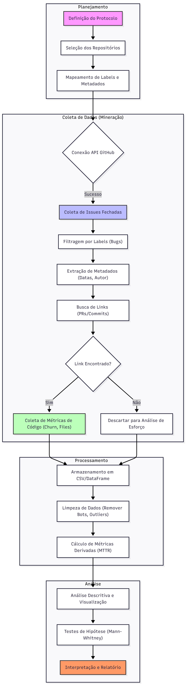

# Análise Comparativa de Manutenibilidade e Tempo de Resolução de Issues: Plataformas Low-Code Open Source vs. Frameworks Web Tradicionais

Estudo empírico comparando a eficiência de manutenção (tempo de resolução de issues) entre Plataformas Low-Code Open Source (e.g., Appsmith, Budibase, ToolJet) e Frameworks Web Tradicionais (e.g., React, Vue.js, NestJS).

# Plano de Experimento – Scoping e Planejamento

## 1. Identificação básica

### 1.1 Título do experimento
Análise Comparativa de Manutenibilidade e Tempo de Resolução de Issues: Plataformas Low-Code Open Source vs. Frameworks Web Tradicionais.

### 1.2 ID / código
`EXP-TCC-2025-LCT` (Low-Code vs Traditional Analysis)

### 1.3 Versão do documento e histórico de revisão
* **v1.0** (21/11/2025): Revisão do plano inicial, definição de hipóteses e escopo de mineração de dados.
* **v1.1** (25/11/2025): Escopo, Objetivo, Stakeholders/Impacto, Riscos de alto nível, premissas e critérios de sucesso
* **v1.2** (28/11/2025): Revisão do plano inicial, definição de hipóteses e escopo de mineração de dados.
* **v1.3** (02/12/2025): População, sujeitos, amostragem, instrumentação, protocolo operacional, plano de análise de dados.

### 1.4 Datas (criação, última atualização)
* **Criação:** 21/11/2025
* **Última atualização:** 02/12/2025

### 1.5 Autores (nome, área, contato)
* **Davi José Ferreira:** Estudante de Engenharia de Software - davi.ferreira.1408962@sga.pucminas.br

### 1.6 Responsável principal (PI / dono do experimento)
* **Davi José Ferreira:** Pesquisador Principal.

### 1.7 Projeto / produto / iniciativa relacionada
Este experimento compõe o trabalho final de "Proposta de Experimento para TCC" da disciplina de Medição e Experimentação em Engenharia de Software.

---

## 2. Contexto e problema

### 2.1 Descrição do problema / oportunidade
O desenvolvimento Low-Code promete acelerar a entrega de software através de abstração e interfaces visuais. No entanto, existe uma lacuna no entendimento sobre a **manutenibilidade interna** das próprias plataformas que oferecem esses recursos.

O problema investigado é se a complexidade arquitetural e o alto acoplamento inerentes às plataformas Low-Code Open Source resultam em um ciclo de correção de defeitos mais lento em comparação com frameworks web tradicionais baseados em código ("Pro-Code"), que tendem a ser mais modulares. A oportunidade é fornecer evidências empíricas para CTOs e arquitetos sobre a sustentabilidade e agilidade de evolução dessas ferramentas a longo prazo.

### 2.2 Contexto organizacional e técnico
O experimento ocorrerá no contexto de **Software Livre (Open Source)** hospedado no GitHub. O estudo caracteriza-se como **Mineração de Repositórios de Software (MSR)**.
* **Ambiente:** Repositórios públicos de alta relevância (>10k stars).
* **Tecnologias:** Python (para scripts de coleta), GitHub REST API (fonte de dados).
* **Domínio:** Ferramentas de desenvolvimento de software (Developer Tools).

### 2.3 Trabalhos e evidências prévias (internos e externos)
A principal fundamentação para este estudo baseia-se no mapeamento sistemático realizado por **Khorram et al. (2020)**, intitulado *"Problems and opportunities in low-code development"*.
* **Evidência:** Os autores identificaram que a **manutenibilidade** é um dos desafios técnicos mais críticos e citados na adoção de plataformas Low-Code, devido às dificuldades de versionamento e à complexidade oculta gerada pela abstração.
* **Lacuna:** Embora o estudo de Khorram aponte o problema de forma qualitativa através da literatura, há uma escassez de estudos empíricos que quantifiquem essa dificuldade comparando diretamente a **eficiência do processo de manutenção** (*Issue Tracking*) entre os repositórios de plataformas Low-Code e os de frameworks tradicionais.

### 2.4 Referencial teórico e empírico essencial
O desenho experimental fundamenta-se nos seguintes conceitos:
1.  **Manutenibilidade (ISO/IEC 25010):** Capacidade do produto de software ser modificado de forma eficaz e eficiente.
2.  **Issue Resolution Time (Tempo de Resolução):** Métrica proxy amplamente aceita na indústria e academia para medir esforço de manutenção e complexidade oculta.
3.  **Dívida Técnica:** O custo implícito de retrabalho causado pela escolha de uma solução fácil (ou arquiteturalmente complexa) agora, em vez de uma abordagem melhor que levaria mais tempo.
4.  **Arquitetura Monolítica vs. Modular:** A premissa teórica de que plataformas Low-Code tendem a ser monólitos acoplados (interface + lógica + dados), dificultando a isolação e correção de falhas.

---

## 3. Objetivos e questões (Goal / Question / Metric)

### 3.1 Objetivo geral (Goal template)
Analisar a **manutenibilidade** (focando em tempo de resolução de issues e esforço de alteração) de **Plataformas Low-Code Open Source** comparadas a **Frameworks Web Tradicionais**, com o propósito de **avaliar a eficiência de manutenção e evolução**, sob a perspectiva de **Arquitetos de Software e Gestores de Tecnologia**, no contexto de **projetos de código aberto hospedados no GitHub**.

### 3.2 Objetivos específicos
*   **O1:** Comparar a velocidade de correção de defeitos (bug fixing) entre os dois tipos de tecnologia.
*   **O2:** Analisar a complexidade das alterações necessárias para correções (esforço de código).
*   **O3:** Avaliar a estabilidade das correções (incidência de reabertura de issues ou regressões).
*   **O4:** Investigar o engajamento da comunidade no processo de manutenção (dependência do core team).

### 3.3 Questões de pesquisa e 3.4 Métricas associadas (GQM)

| Objetivo | Questão de Pesquisa | Métricas Associadas |
| :--- | :--- | :--- |
| **O1. Velocidade** | **Q1.1** Qual é a diferença no Tempo Médio de Resolução (MTTR) de bugs entre plataformas Low-Code e frameworks tradicionais? | - MTTR (Mean Time to Resolution) - Issue Age (para issues abertas) |
| | **Q1.2** A distribuição do tempo de fechamento de issues varia significativamente entre os grupos (cauda longa de bugs complexos)? | - Issue Close Time Percentiles (P50, P90, P99) - Std Dev of Close Time |
| | **Q1.3** Qual é o tempo mediano de vida de um bug crítico? | - Critical Bug Resolution Time - Critical Bug Count |
| **O2. Esforço** | **Q2.1** Qual é o tamanho médio dos commits (churn) associados a correções de bugs em cada grupo? | - Code Churn (Lines Added + Deleted) - Commit Count per Issue |
| | **Q2.2** Quantos arquivos são modificados em média para resolver uma issue (dispersão da mudança)? | - Files Changed Count - Directory Spread (pastas afetadas) |
| | **Q2.3** O tamanho do patch (linhas adicionadas/removidas) difere significativamente entre os grupos? | - Patch Size (Bytes) - Hunks Count |
| **O3. Estabilidade** | **Q3.1** Qual a taxa de reabertura de issues (bugs que voltaram)? | - Reopen Rate - Reopen Count |
| | **Q3.2** Qual a proporção de issues marcadas como "wontfix" ou "invalid"? | - Invalid Issue Rate - Wontfix Issue Rate |
| | **Q3.3** Qual a frequência de issues linkadas a commits de "revert"? | - Revert Commit Rate - Regression Label Count |
| **O4. Comunidade** | **Q4.1** Qual o tempo médio para a primeira resposta da equipe/comunidade em uma nova issue? | - Time to First Response - Time to First Triage |
| | **Q4.2** Qual a proporção de issues resolvidas por contribuidores externos vs. time core? | - External Contributor Ratio - Core Team Commit Ratio |
| | **Q4.3** Qual o número médio de participantes na discussão de um bug? | - Comment Count - Unique Commenters Count |

### Tabela de Definição de Métricas

| Métrica | Descrição | Unidade |
| :--- | :--- | :--- |
| **MTTR (Mean Time to Resolution)** | Tempo médio decorrido entre a abertura e o fechamento de uma issue classificada como bug. | Horas / Dias |
| **Issue Age** | Tempo decorrido desde a abertura até o momento atual para issues ainda abertas. | Dias |
| **Issue Close Time Percentiles** | Valores de tempo de fechamento abaixo dos quais se encontram 50%, 90% e 99% das observações. | Dias |
| **Std Dev of Close Time** | Desvio padrão do tempo de fechamento, indicando a variabilidade do processo de correção. | Dias |
| **Critical Bug Resolution Time** | Tempo de resolução específico para issues com labels de alta prioridade (e.g., `critical`, `high`). | Horas |
| **Code Churn** | Soma de linhas de código adicionadas e removidas nos commits associados à issue. | Linhas de Código (LOC) |
| **Commit Count per Issue** | Número total de commits vinculados a uma única issue. | Quantidade (Inteiro) |
| **Files Changed Count** | Número de arquivos únicos modificados nos commits da issue. | Quantidade (Inteiro) |
| **Directory Spread** | Número de diretórios distintos que contêm arquivos modificados na correção. | Quantidade (Inteiro) |
| **Patch Size** | Tamanho total em bytes do diff gerado pela correção. | Bytes |
| **Reopen Rate** | Porcentagem de issues que foram reabertas após terem sido fechadas. | Porcentagem (%) |
| **Invalid Issue Rate** | Porcentagem de issues fechadas com labels indicando inválido (`invalid`, `duplicate`). | Porcentagem (%) |
| **Revert Commit Rate** | Porcentagem de correções que resultaram em um commit posterior de reversão (`revert`). | Porcentagem (%) |
| **Time to First Response** | Tempo decorrido entre a abertura da issue e o primeiro comentário de um membro (não autor). | Horas |
| **External Contributor Ratio** | Proporção de issues resolvidas (PR mergeado) por usuários que não são mantenedores do repositório. | Porcentagem (%) |
| **Comment Count** | Número total de comentários na thread da issue. | Quantidade (Inteiro) |
| **Unique Commenters Count** | Número de usuários distintos que participaram da discussão da issue. | Quantidade (Inteiro) |

---

## 4. Escopo e contexto do experimento

### 4.1 Escopo funcional / de processo (incluído e excluído)
*   **Incluído:**
    *   Análise de issues fechadas e commits associados (via link na issue) em repositórios públicos do GitHub.
    *   Foco estrito em issues classificadas semanticamente como "bug", "fix" ou "defect" através de labels ou mineração de texto no título.
    *   Repositórios com mais de 10.000 estrelas para garantir relevância e maturidade de processo.
*   **Excluído:**
    *   Issues de "feature request", "enhancement", documentação ou dúvidas (questions).
    *   Repositórios privados ou plataformas Low-Code proprietárias (sem acesso ao código fonte).
    *   Análise de qualidade de código estática (SonarQube) não está no escopo principal deste estudo de *processo*, mas sim a métrica de *tempo e esforço*.

### 4.2 Contexto do estudo (tipo de organização, projeto, experiência)
*   **Tipo de Organização:** Projetos Open Source mantidos majoritariamente por empresas comerciais (e.g., Appsmith Inc., Vercel, Facebook/Meta) com forte apoio da comunidade.
*   **Tipo de Projeto:** Ferramentas de desenvolvimento de software (Developer Tools), caracterizadas por alta complexidade técnica.
*   **Perfil de Experiência:** Desenvolvedores profissionais, mantenedores core e contribuidores open source distribuídos globalmente.

### 4.3 Premissas
*   As issues estão corretamente etiquetadas (labels como `bug`, `fix`, `type:bug`) nos repositórios selecionados, permitindo a filtragem automática.
*   O link entre issues e Pull Requests/Commits é rastreável na maioria dos casos (via "Closing keywords" do GitHub).
*   A API do GitHub permanecerá estável e acessível durante o período de coleta de dados.

### 4.4 Restrições
*   **Limitação de API:** O GitHub impõe um limite de 5.000 requisições por hora para usuários autenticados, o que pode prolongar o tempo de coleta.
*   **Tempo:** O experimento deve ser concluído dentro do semestre letivo.
*   **Acesso:** Impossibilidade de entrevistar os desenvolvedores para entender o contexto qualitativo de cada bug ("caixa preta").

### 4.5 Limitações previstas
*   **Viés de seleção:** Os repositórios escolhidos podem não representar todo o universo Low-Code/Tradicional, limitando a generalização (validade externa).
*   **Qualidade dos dados:** Issues podem ter sido fechadas sem correção real, ou correções feitas sem link explícito, gerando ruído nos dados.

---

## 5. Stakeholders e impacto esperado

### 5.1 Stakeholders principais
*   **CTOs e Decisores de Tecnologia:** Responsáveis pela escolha de stack tecnológica em empresas.
*   **Arquitetos de Software:** Interessados na manutenibilidade arquitetural e dívida técnica de longo prazo.
*   **Equipes de Desenvolvimento:** Interessados em saber se a ferramenta facilita ou dificulta o dia a dia de correções.
*   **Pesquisadores de Engenharia de Software:** Interesse na validação empírica de métricas de manutenção em novos paradigmas de desenvolvimento.

### 5.2 Interesses e expectativas dos stakeholders
*   **Decisores:** Esperam dados quantitativos para justificar o ROI e avaliar o risco de "lock-in" de manutenção difícil a longo prazo com Low-Code.
*   **Arquitetos:** Buscam evidências de que a abstração do Low-Code não cobra um preço alto demais em complexidade de manutenção.
*   **Pesquisador:** Espera identificar padrões distintos de evolução entre os dois paradigmas e publicar os resultados.

### 5.3 Impactos potenciais no processo / produto
*   **No Experimento:** A execução é passiva (mineração de dados históricos), portanto não há impacto direto nos produtos ou equipes analisadas.
*   **Pós-Experimento:** Os resultados podem influenciar diretrizes de adoção de Low-Code na indústria, potencialmente desencorajando o uso para sistemas críticos se a manutenibilidade for comprovadamente pior, ou validando a tecnologia caso seja equivalente/melhor.

---

## 6. Riscos de alto nível, premissas e critérios de sucesso

### 6.1 Riscos de alto nível (negócio, técnicos, etc.)
*   **Risco Técnico (Médio):** Dificuldade em normalizar dados entre repositórios com processos diferentes (ex: taxonomias de labels inconsistentes).
    *   *Mitigação:* Criar um mapa de equivalência de labels para cada repositório antes da análise.
*   **Risco de Dados (Alto):** Baixa quantidade de links explícitos entre Issue e Commit em alguns projetos, reduzindo a amostra para métricas de esforço (churn).
    *   *Mitigação:* Utilizar heurísticas de busca textual em mensagens de commit (e.g., "fixes #123") se os links diretos forem escassos.
# Análise Comparativa de Manutenibilidade e Tempo de Resolução de Issues: Plataformas Low-Code Open Source vs. Frameworks Web Tradicionais

Estudo empírico comparando a eficiência de manutenção (tempo de resolução de issues) entre Plataformas Low-Code Open Source (e.g., Appsmith, Budibase, ToolJet) e Frameworks Web Tradicionais (e.g., React, Vue.js, NestJS).

# Plano de Experimento – Scoping e Planejamento

## 1. Identificação básica

### 1.1 Título do experimento
Análise Comparativa de Manutenibilidade e Tempo de Resolução de Issues: Plataformas Low-Code Open Source vs. Frameworks Web Tradicionais.

### 1.2 ID / código
`EXP-TCC-2025-LCT` (Low-Code vs Traditional Analysis)

### 1.3 Versão do documento e histórico de revisão
* **v1.0** (21/11/2025): Revisão do plano inicial, definição de hipóteses e escopo de mineração de dados.
* **v1.1** (25/11/2025): Escopo, Objetivo, Stakeholders/Impacto, Riscos de alto nível, premissas e critérios de sucesso

### 1.4 Datas (criação, última atualização)
* **Criação:** 21/11/2025
* **Última atualização:** 25/11/2025

### 1.5 Autores (nome, área, contato)
* **Davi José Ferreira:** Estudante de Engenharia de Software - davi.ferreira.1408962@sga.pucminas.br

### 1.6 Responsável principal (PI / dono do experimento)
* **Davi José Ferreira:** Pesquisador Principal.

### 1.7 Projeto / produto / iniciativa relacionada
Este experimento compõe o trabalho final de "Proposta de Experimento para TCC" da disciplina de Medição e Experimentação em Engenharia de Software.

---

## 2. Contexto e problema

### 2.1 Descrição do problema / oportunidade
O desenvolvimento Low-Code promete acelerar a entrega de software através de abstração e interfaces visuais. No entanto, existe uma lacuna no entendimento sobre a **manutenibilidade interna** das próprias plataformas que oferecem esses recursos.

O problema investigado é se a complexidade arquitetural e o alto acoplamento inerentes às plataformas Low-Code Open Source resultam em um ciclo de correção de defeitos mais lento em comparação com frameworks web tradicionais baseados em código ("Pro-Code"), que tendem a ser mais modulares. A oportunidade é fornecer evidências empíricas para CTOs e arquitetos sobre a sustentabilidade e agilidade de evolução dessas ferramentas a longo prazo.

### 2.2 Contexto organizacional e técnico
O experimento ocorrerá no contexto de **Software Livre (Open Source)** hospedado no GitHub. O estudo caracteriza-se como **Mineração de Repositórios de Software (MSR)**.
* **Ambiente:** Repositórios públicos de alta relevância (>10k stars).
* **Tecnologias:** Python (para scripts de coleta), GitHub REST API (fonte de dados).
* **Domínio:** Ferramentas de desenvolvimento de software (Developer Tools).

### 2.3 Trabalhos e evidências prévias (internos e externos)
A principal fundamentação para este estudo baseia-se no mapeamento sistemático realizado por **Khorram et al. (2020)**, intitulado *"Problems and opportunities in low-code development"*.
* **Evidência:** Os autores identificaram que a **manutenibilidade** é um dos desafios técnicos mais críticos e citados na adoção de plataformas Low-Code, devido às dificuldades de versionamento e à complexidade oculta gerada pela abstração.
* **Lacuna:** Embora o estudo de Khorram aponte o problema de forma qualitativa através da literatura, há uma escassez de estudos empíricos que quantifiquem essa dificuldade comparando diretamente a **eficiência do processo de manutenção** (*Issue Tracking*) entre os repositórios de plataformas Low-Code e os de frameworks tradicionais.

### 2.4 Referencial teórico e empírico essencial
O desenho experimental fundamenta-se nos seguintes conceitos:
1.  **Manutenibilidade (ISO/IEC 25010):** Capacidade do produto de software ser modificado de forma eficaz e eficiente.
2.  **Issue Resolution Time (Tempo de Resolução):** Métrica proxy amplamente aceita na indústria e academia para medir esforço de manutenção e complexidade oculta.
3.  **Dívida Técnica:** O custo implícito de retrabalho causado pela escolha de uma solução fácil (ou arquiteturalmente complexa) agora, em vez de uma abordagem melhor que levaria mais tempo.
4.  **Arquitetura Monolítica vs. Modular:** A premissa teórica de que plataformas Low-Code tendem a ser monólitos acoplados (interface + lógica + dados), dificultando a isolação e correção de falhas.

---

## 3. Objetivos e questões (Goal / Question / Metric)

### 3.1 Objetivo geral (Goal template)
Analisar a **manutenibilidade** (focando em tempo de resolução de issues e esforço de alteração) de **Plataformas Low-Code Open Source** comparadas a **Frameworks Web Tradicionais**, com o propósito de **avaliar a eficiência de manutenção e evolução**, sob a perspectiva de **Arquitetos de Software e Gestores de Tecnologia**, no contexto de **projetos de código aberto hospedados no GitHub**.

### 3.2 Objetivos específicos
*   **O1:** Comparar a velocidade de correção de defeitos (bug fixing) entre os dois tipos de tecnologia.
*   **O2:** Analisar a complexidade das alterações necessárias para correções (esforço de código).
*   **O3:** Avaliar a estabilidade das correções (incidência de reabertura de issues ou regressões).
*   **O4:** Investigar o engajamento da comunidade no processo de manutenção (dependência do core team).

### 3.3 Questões de pesquisa e 3.4 Métricas associadas (GQM)

| Objetivo | Questão de Pesquisa | Métricas Associadas |
| :--- | :--- | :--- |
| **O1. Velocidade** | **Q1.1** Qual é a diferença no Tempo Médio de Resolução (MTTR) de bugs entre plataformas Low-Code e frameworks tradicionais? | - MTTR (Mean Time to Resolution) - Issue Age (para issues abertas) |
| | **Q1.2** A distribuição do tempo de fechamento de issues varia significativamente entre os grupos (cauda longa de bugs complexos)? | - Issue Close Time Percentiles (P50, P90, P99) - Std Dev of Close Time |
| | **Q1.3** Qual é o tempo mediano de vida de um bug crítico? | - Critical Bug Resolution Time - Critical Bug Count |
| **O2. Esforço** | **Q2.1** Qual é o tamanho médio dos commits (churn) associados a correções de bugs em cada grupo? | - Code Churn (Lines Added + Deleted) - Commit Count per Issue |
| | **Q2.2** Quantos arquivos são modificados em média para resolver uma issue (dispersão da mudança)? | - Files Changed Count - Directory Spread (pastas afetadas) |
| | **Q2.3** O tamanho do patch (linhas adicionadas/removidas) difere significativamente entre os grupos? | - Patch Size (Bytes) - Hunks Count |
| **O3. Estabilidade** | **Q3.1** Qual a taxa de reabertura de issues (bugs que voltaram)? | - Reopen Rate - Reopen Count |
| | **Q3.2** Qual a proporção de issues marcadas como "wontfix" ou "invalid"? | - Invalid Issue Rate - Wontfix Issue Rate |
| | **Q3.3** Qual a frequência de issues linkadas a commits de "revert"? | - Revert Commit Rate - Regression Label Count |
| **O4. Comunidade** | **Q4.1** Qual o tempo médio para a primeira resposta da equipe/comunidade em uma nova issue? | - Time to First Response - Time to First Triage |
| | **Q4.2** Qual a proporção de issues resolvidas por contribuidores externos vs. time core? | - External Contributor Ratio - Core Team Commit Ratio |
| | **Q4.3** Qual o número médio de participantes na discussão de um bug? | - Comment Count - Unique Commenters Count |

### Tabela de Definição de Métricas

| Métrica | Descrição | Unidade |
| :--- | :--- | :--- |
| **MTTR (Mean Time to Resolution)** | Tempo médio decorrido entre a abertura e o fechamento de uma issue classificada como bug. | Horas / Dias |
| **Issue Age** | Tempo decorrido desde a abertura até o momento atual para issues ainda abertas. | Dias |
| **Issue Close Time Percentiles** | Valores de tempo de fechamento abaixo dos quais se encontram 50%, 90% e 99% das observações. | Dias |
| **Std Dev of Close Time** | Desvio padrão do tempo de fechamento, indicando a variabilidade do processo de correção. | Dias |
| **Critical Bug Resolution Time** | Tempo de resolução específico para issues com labels de alta prioridade (e.g., `critical`, `high`). | Horas |
| **Code Churn** | Soma de linhas de código adicionadas e removidas nos commits associados à issue. | Linhas de Código (LOC) |
| **Commit Count per Issue** | Número total de commits vinculados a uma única issue. | Quantidade (Inteiro) |
| **Files Changed Count** | Número de arquivos únicos modificados nos commits da issue. | Quantidade (Inteiro) |
| **Directory Spread** | Número de diretórios distintos que contêm arquivos modificados na correção. | Quantidade (Inteiro) |
| **Patch Size** | Tamanho total em bytes do diff gerado pela correção. | Bytes |
| **Reopen Rate** | Porcentagem de issues que foram reabertas após terem sido fechadas. | Porcentagem (%) |
| **Invalid Issue Rate** | Porcentagem de issues fechadas com labels indicando inválido (`invalid`, `duplicate`). | Porcentagem (%) |
| **Revert Commit Rate** | Porcentagem de correções que resultaram em um commit posterior de reversão (`revert`). | Porcentagem (%) |
| **Time to First Response** | Tempo decorrido entre a abertura da issue e o primeiro comentário de um membro (não autor). | Horas |
| **External Contributor Ratio** | Proporção de issues resolvidas (PR mergeado) por usuários que não são mantenedores do repositório. | Porcentagem (%) |
| **Comment Count** | Número total de comentários na thread da issue. | Quantidade (Inteiro) |
| **Unique Commenters Count** | Número de usuários distintos que participaram da discussão da issue. | Quantidade (Inteiro) |

---

## 4. Escopo e contexto do experimento

### 4.1 Escopo funcional / de processo (incluído e excluído)
*   **Incluído:**
    *   Análise de issues fechadas e commits associados (via link na issue) em repositórios públicos do GitHub.
    *   Foco estrito em issues classificadas semanticamente como "bug", "fix" ou "defect" através de labels ou mineração de texto no título.
    *   Repositórios com mais de 10.000 estrelas para garantir relevância e maturidade de processo.
*   **Excluído:**
    *   Issues de "feature request", "enhancement", documentação ou dúvidas (questions).
    *   Repositórios privados ou plataformas Low-Code proprietárias (sem acesso ao código fonte).
    *   Análise de qualidade de código estática (SonarQube) não está no escopo principal deste estudo de *processo*, mas sim a métrica de *tempo e esforço*.

### 4.2 Contexto do estudo (tipo de organização, projeto, experiência)
*   **Tipo de Organização:** Projetos Open Source mantidos majoritariamente por empresas comerciais (e.g., Appsmith Inc., Vercel, Facebook/Meta) com forte apoio da comunidade.
*   **Tipo de Projeto:** Ferramentas de desenvolvimento de software (Developer Tools), caracterizadas por alta complexidade técnica.
*   **Perfil de Experiência:** Desenvolvedores profissionais, mantenedores core e contribuidores open source distribuídos globalmente.

### 4.3 Premissas
*   As issues estão corretamente etiquetadas (labels como `bug`, `fix`, `type:bug`) nos repositórios selecionados, permitindo a filtragem automática.
*   O link entre issues e Pull Requests/Commits é rastreável na maioria dos casos (via "Closing keywords" do GitHub).
*   A API do GitHub permanecerá estável e acessível durante o período de coleta de dados.

### 4.4 Restrições
*   **Limitação de API:** O GitHub impõe um limite de 5.000 requisições por hora para usuários autenticados, o que pode prolongar o tempo de coleta.
*   **Tempo:** O experimento deve ser concluído dentro do semestre letivo.
*   **Acesso:** Impossibilidade de entrevistar os desenvolvedores para entender o contexto qualitativo de cada bug ("caixa preta").

### 4.5 Limitações previstas
*   **Viés de seleção:** Os repositórios escolhidos podem não representar todo o universo Low-Code/Tradicional, limitando a generalização (validade externa).
*   **Qualidade dos dados:** Issues podem ter sido fechadas sem correção real, ou correções feitas sem link explícito, gerando ruído nos dados.

---

## 5. Stakeholders e impacto esperado

### 5.1 Stakeholders principais
*   **CTOs e Decisores de Tecnologia:** Responsáveis pela escolha de stack tecnológica em empresas.
*   **Arquitetos de Software:** Interessados na manutenibilidade arquitetural e dívida técnica de longo prazo.
*   **Equipes de Desenvolvimento:** Interessados em saber se a ferramenta facilita ou dificulta o dia a dia de correções.
*   **Pesquisadores de Engenharia de Software:** Interesse na validação empírica de métricas de manutenção em novos paradigmas de desenvolvimento.

### 5.2 Interesses e expectativas dos stakeholders
*   **Decisores:** Esperam dados quantitativos para justificar o ROI e avaliar o risco de "lock-in" de manutenção difícil a longo prazo com Low-Code.
*   **Arquitetos:** Buscam evidências de que a abstração do Low-Code não cobra um preço alto demais em complexidade de manutenção.
*   **Pesquisador:** Espera identificar padrões distintos de evolução entre os dois paradigmas e publicar os resultados.

### 5.3 Impactos potenciais no processo / produto
*   **No Experimento:** A execução é passiva (mineração de dados históricos), portanto não há impacto direto nos produtos ou equipes analisadas.
*   **Pós-Experimento:** Os resultados podem influenciar diretrizes de adoção de Low-Code na indústria, potencialmente desencorajando o uso para sistemas críticos se a manutenibilidade for comprovadamente pior, ou validando a tecnologia caso seja equivalente/melhor.

---

## 6. Riscos de alto nível, premissas e critérios de sucesso

### 6.1 Riscos de alto nível (negócio, técnicos, etc.)
*   **Risco Técnico (Médio):** Dificuldade em normalizar dados entre repositórios com processos diferentes (ex: taxonomias de labels inconsistentes).
    *   *Mitigação:* Criar um mapa de equivalência de labels para cada repositório antes da análise.
*   **Risco de Dados (Alto):** Baixa quantidade de links explícitos entre Issue e Commit em alguns projetos, reduzindo a amostra para métricas de esforço (churn).
    *   *Mitigação:* Utilizar heurísticas de busca textual em mensagens de commit (e.g., "fixes #123") se os links diretos forem escassos.

### 6.2 Critérios de sucesso globais (go / no-go)
*   Coleta de pelo menos **1.000 issues válidas** (classificadas como bug e fechadas) de cada grupo (Low-Code vs Tradicional).
*   Capacidade de responder a pelo menos **80% das Questões de Pesquisa** com significância estatística (p-value < 0.05).
*   Identificação de pelo menos **3 repositórios comparáveis** em cada categoria.

### 6.3 Critérios de parada antecipada (pré-execução)
*   Se, durante a análise exploratória inicial, for identificado que menos de **10% das issues** possuem links rastreáveis para commits/PRs, a análise de "esforço de código" (Objetivo O2) será abortada ou reescopada, mantendo-se apenas a análise temporal (Objetivo O1), pois a mineração manual seria inviável pelo tempo disponível.

---

## 7. Modelo conceitual e hipóteses

### 7.1 Modelo conceitual do experimento
O modelo conceitual baseia-se na premissa de que a **Complexidade Acidental** introduzida pelas camadas de abstração das plataformas Low-Code impacta negativamente a manutenibilidade interna do projeto.

*   **Fator (Causa):** Tipo de Tecnologia (Low-Code vs Framework Tradicional).
*   **Mecanismo:** Plataformas Low-Code tendem a ter arquiteturas mais acopladas e bases de código maiores/mais complexas para sustentar a generacidade dos editores visuais.
*   **Efeito (Resposta):** Aumento no tempo necessário para diagnosticar e corrigir defeitos (MTTR) e maior esforço de código (Churn) para correções similares.

**Esquema:**
`Tecnologia Low-Code` -> `Maior Abstração/Acoplamento` -> `Maior Dificuldade de Debugging` -> `Maior MTTR`

### 7.2 Hipóteses formais (H0, H1)

**Para O1 (Velocidade - MTTR):**
*   **H0_1:** Não há diferença significativa no Tempo Médio de Resolução de bugs entre plataformas Low-Code e Frameworks Tradicionais. ($MTTR_{LC} = MTTR_{Trad}$)
*   **H1_1:** O Tempo Médio de Resolução de bugs em plataformas Low-Code é maior do que em Frameworks Tradicionais. ($MTTR_{LC} > MTTR_{Trad}$)

**Para O2 (Esforço - Code Churn):**
*   **H0_2:** Não há diferença significativa no tamanho médio dos commits de correção entre os grupos. ($Churn_{LC} = Churn_{Trad}$)
*   **H1_2:** As correções em plataformas Low-Code exigem maior alteração de código (maior Churn) devido à complexidade interna. ($Churn_{LC} > Churn_{Trad}$)

### 7.3 Nível de significância e considerações de poder
*   **Nível de Significância ($\alpha$):** 0,05 (5%).
*   **Poder Estatístico ($1 - \beta$):** Espera-se um poder alto (> 0.80) dado o tamanho planejado da amostra.
*   **Tamanho da Amostra:** Com a meta de 1.000 issues por grupo, o estudo terá sensibilidade suficiente para detectar até mesmo tamanhos de efeito pequenos (Cohen's d ~ 0.2) usando testes não-paramétricos (Mann-Whitney U), que são adequados para distribuições de tempo de resolução (geralmente não-normais).

---

## 8. Variáveis, fatores, tratamentos e objetos de estudo

### 8.1 Objetos de estudo
Os objetos de estudo são as **Issues** (classificadas como bugs) fechadas nos repositórios selecionados e seus respectivos **Pull Requests/Commits** de correção.

### 8.2 Sujeitos / participantes (visão geral)
Neste estudo de Mineração de Repositórios de Software (MSR), não há recrutamento direto de participantes humanos. Os "sujeitos" indiretos são os desenvolvedores (core team e contribuidores) que atuaram na resolução das issues analisadas.

### 8.3 Variáveis independentes (fatores) e seus níveis
*   **Fator Principal:** Tipo de Plataforma de Desenvolvimento.
*   **Níveis:**
    1.  Plataformas Low-Code Open Source.
    2.  Frameworks Web Tradicionais.

### 8.4 Tratamentos (condições experimentais)
*   **Tratamento A (Grupo Experimental):** Conjunto de issues extraídas de repositórios Low-Code (e.g., Appsmith, ToolJet).
*   **Tratamento B (Grupo Controle/Comparação):** Conjunto de issues extraídas de repositórios de Frameworks Tradicionais (e.g., React, Vue).

### 8.5 Variáveis dependentes (respostas)
As variáveis dependentes são as métricas definidas na seção GQM, focando em:
1.  **Tempo:** MTTR, Issue Age.
2.  **Esforço:** Code Churn, Files Changed.
3.  **Estabilidade:** Reopen Rate.

### 8.6 Variáveis de controle / bloqueio
Para mitigar vieses, os seguintes critérios são mantidos constantes (controle):
*   **Domínio:** Ferramentas de desenvolvimento (DevTools).
*   **Popularidade:** Repositórios com > 10k stars.
*   **Linguagem Principal:** Ecossistema JavaScript/TypeScript.
*   **Período:** Issues fechadas nos últimos 24 meses (para garantir relevância atual).

### 8.7 Possíveis variáveis de confusão conhecidas
*   **Tamanho da Comunidade:** Projetos maiores (ex: React) têm mais gente para fixar bugs, mas também mais bugs reportados.
*   **Rigor do Processo:** Alguns projetos exigem testes complexos antes do merge, aumentando o tempo artificialmente.
*   **Complexidade do Bug:** Um bug "crítico" no Low-Code pode ser intrinsecamente mais difícil que um bug "crítico" no React devido à natureza do software.

### Tabela de Variáveis

| Tipo | Variável | Descrição | Escala |
| :--- | :--- | :--- | :--- |
| **Independente** | Tipo de Plataforma | Categoria do repositório (Low-Code ou Tradicional). | Nominal |
| **Dependente** | MTTR | Tempo em horas da abertura ao fechamento da issue. | Razão |
| **Dependente** | Code Churn | Soma de linhas adicionadas e removidas na correção. | Razão |
| **Dependente** | Files Changed | Número de arquivos alterados. | Razão |
| **Controle** | Linguagem | Linguagem predominante do repositório (TS/JS). | Nominal |
| **Controle** | Popularidade | Número de estrelas do repositório (>10k). | Ordinal |

### Tabela de Fatores e Tratamentos

| Fator | Nível 1 (Tratamento A) | Nível 2 (Tratamento B) |
| :--- | :--- | :--- |
| **Tecnologia** | **Low-Code Open Source** (Appsmith, Budibase, ToolJet) | **Framework Web Tradicional** (React, Vue, Svelte/NestJS) |

---

## 9. Desenho experimental

### 9.1 Tipo de desenho
Será utilizado um **Desenho Quase-Experimental (Quasi-Experiment)**, especificamente um estudo comparativo ex-post-facto.
*   **Justificativa:** Não é possível randomizar bugs para serem "Low-Code" ou "Tradicionais", nem randomizar desenvolvedores. Analisamos dados históricos que já ocorreram.

### 9.2 Randomization e alocação
*   **Seleção de Repositórios:** Seleção intencional (Purposive Sampling) baseada em critérios de popularidade e relevância para garantir comparabilidade.
*   **Seleção de Issues:** Será feita uma coleta exaustiva (todos os dados disponíveis) dentro da janela de tempo definida (últimos 2 anos). Se o volume for excessivo (>100k), será aplicada uma **Amostragem Aleatória Simples** para selecionar 1.000 issues de cada grupo.

### 9.3 Balanceamento e contrabalanço
*   **Balanceamento:** O número de repositórios em cada grupo será igual (ex: 3 vs 3) ou próximo. Buscaremos balancear o tamanho da amostra final (N=1000 para cada lado) através de subamostragem se um grupo for muito maior que o outro.
*   **Contrabalanço:** Não se aplica, pois não há sessões repetidas com os mesmos sujeitos realizando tarefas em ordens diferentes.

### 9.4 Número de grupos e sessões
*   **Grupos:** 2 grupos independentes (Low-Code e Tradicional).
*   **Sessões:** Não se aplica a estudo de mineração de dados (coleta única).

---

## 10. População, sujeitos e amostragem

### 10.1 População-alvo
A população-alvo deste estudo é composta por **Issues de manutenção corretiva (bugs)** e seus respectivos artefatos de resolução (Pull Requests e Commits) em projetos de software Open Source de alta relevância no ecossistema de desenvolvimento web moderno.
*   **Unidade de Análise:** A "Issue" (relatório de defeito) resolvida.

### 10.2 Critérios de inclusão de sujeitos (Issues/Repositórios)
Para serem incluídos na amostra, os repositórios e issues devem atender aos seguintes critérios:
*   **Repositórios:**
    *   Estar hospedado publicamente no GitHub.
    *   Possuir mais de 1.000 estrelas (indicativo de relevância e comunidade ativa).
    *   Ter o inglês como idioma principal de comunicação.
    *   Pertencer inequivocamente a uma das categorias: Plataforma Low-Code ou Framework Web.
*   **Issues:**
    *   Estar no estado `Closed`.
    *   Possuir label explícita de `bug`, `defect`, `fix` ou similar (conforme mapeamento).
    *   Ter sido fechada nos últimos 24 meses (janela de relevância temporal).

### 10.3 Critérios de exclusão de sujeitos
Serão excluídos da análise:
*   Issues fechadas sem resolução (labels `wontfix`, `duplicate`, `invalid`, `question`).
*   Issues que não possuem link rastreável para um Commit ou Pull Request (impossibilitando a medição de esforço de código).
*   Issues criadas e fechadas por bots automatizados (ex: dependabot), pois distorcem o MTTR humano.
*   Repositórios que não utilizam o Issue Tracking do GitHub (ex: usam Jira externo sem integração visível).

### 10.4 Tamanho da amostra planejado (por grupo)
*   **Total Planejado:** 2.000 issues válidas.
*   **Grupo Experimental (Low-Code):** 1.000 issues.
*   **Grupo Controle (Tradicional):** 1.000 issues.
*   **Justificativa:** Este tamanho de amostra fornece poder estatístico suficiente (>0.80) para detectar tamanhos de efeito pequenos a médios, considerando a alta variância típica em métricas de engenharia de software.

### 10.5 Método de seleção / recrutamento
*   **Seleção de Repositórios:** Amostragem Intencional (Purposive Sampling). Os repositórios serão escolhidos manualmente para garantir que representem os líderes de mercado em cada categoria (ex: Appsmith vs React).
*   **Seleção de Issues:** Mineração automatizada exaustiva dentro da janela de tempo. Caso o volume de dados exceda significativamente a meta (ex: >10.000 issues), será aplicado um algoritmo de **Amostragem Aleatória Simples** para selecionar o subconjunto de análise.

### 10.6 Treinamento e preparação dos sujeitos
Como este é um estudo de MSR (Mineração de Repositórios) *ex-post-facto*, não há interação com participantes humanos. O "treinamento" refere-se à validação e calibração dos scripts de coleta pelo pesquisador para garantir a consistência dos dados extraídos.

---

## 11. Instrumentação e protocolo operacional

### 11.1 Instrumentos de coleta
*   **Scripts de Mineração (Python):** Scripts desenvolvidos especificamente para o experimento utilizando a biblioteca `PyGithub`.
*   **GitHub REST API v3:** Fonte primária dos dados brutos.
*   **Jupyter Notebooks:** Ambiente para execução da limpeza, processamento e análise estatística dos dados.
*   **Planilhas/CSV:** Formato de armazenamento intermediário para auditoria manual dos dados coletados.

### 11.2 Materiais de suporte
*   **Dicionário de Labels:** Um documento mapeando as diferentes tags usadas em cada repositório (ex: `type: bug` no Repo A = `bug` no Repo B) para garantir a normalização.
*   **Guia de Auditoria:** Protocolo para verificação manual de uma amostra aleatória de 5% dos dados para garantir que os scripts estão capturando as informações corretas (Validação de Ground Truth).

### 11.3 Procedimento experimental (Fluxograma)

O fluxograma abaixo detalha o passo a passo da operacionalização do experimento, desde a seleção até a análise.

**Passo a Passo Detalhado:**
1.  **Configuração:** Preparação do ambiente Python e tokens de acesso ao GitHub.
2.  **Mapeamento:** Inspeção manual dos repositórios alvo para identificar quais labels correspondem a bugs.
3.  **Coleta Bruta:** Execução do script para baixar todas as issues fechadas nos últimos 24 meses.
4.  **Filtragem:** Aplicação dos critérios de inclusão/exclusão (labels, bots).
5.  **Enriquecimento:** Para cada issue válida, o script busca o PR ou Commit que a fechou para extrair dados de esforço (linhas alteradas).
6.  **Sanitização:** Remoção de dados inconsistentes (ex: datas de fechamento anteriores à abertura).
7.  **Análise:** Execução dos testes estatísticos comparando os grupos.

### 11.4 Plano de piloto
Será realizado um estudo piloto com **1 repositório de cada grupo** (ex: Appsmith vs React) coletando apenas **50 issues** de cada.
*   **Objetivo:** Validar se os scripts de coleta estão funcionando corretamente, se o mapeamento de labels é eficaz e se a API do GitHub impõe bloqueios não previstos.
*   **Ajuste:** Se a taxa de issues sem link para commit for > 50%, o critério de busca de links será refinado (ex: buscar no corpo dos comentários e não apenas nos eventos de fechamento).

---

## 12. Plano de análise de dados (pré-execução)

### 12.1 Estratégia geral de análise
A análise será comparativa, focada em contrastar as distribuições das métricas entre os dois grupos independentes (Low-Code vs Tradicional). O objetivo é rejeitar ou falhar em rejeitar as hipóteses nulas formuladas na seção 7.

### 12.2 Métodos estatísticos planejados
Dada a natureza das métricas de engenharia de software (geralmente assimétricas e com cauda longa), a preferência será por métodos não-paramétricos:
1.  **Estatística Descritiva:**
    *   Cálculo de Média, Mediana, Desvio Padrão, Mínimo, Máximo, Quartis (25%, 75%).
    *   Visualização através de **Boxplots** (para ver dispersão e outliers) e **Violin Plots** (para ver densidade).
2.  **Testes de Hipótese:**
    *   **Mann-Whitney U Test:** Para comparar as medianas de MTTR e Churn entre os dois grupos (assumindo que os dados não seguem distribuição normal).
    *   **Cliff’s Delta:** Para medir o tamanho do efeito (magnitude da diferença) de forma não-paramétrica.
3.  **Correlação (Secundária):**
    *   **Spearman Rank Correlation:** Para investigar se há correlação entre o tamanho do churn e o tempo de resolução dentro de cada grupo.

### 12.3 Tratamento de dados faltantes e outliers
*   **Dados Faltantes:** Issues que não possuem data de fechamento ou data de criação válidas serão excluídas. Issues sem dados de commit (churn) serão excluídas apenas das análises de esforço (O2), mas mantidas nas análises de tempo (O1).
*   **Outliers:**
    *   Valores extremos (ex: issues abertas por 5 anos) são comuns em software e representam casos reais. Eles **não serão removidos** a menos que sejam erros de dados óbvios (ex: data negativa).
    *   Para mitigar o impacto de outliers na análise, o foco principal será na **Mediana** e não na Média.

### 12.4 Plano de análise para dados qualitativos
Embora o estudo seja quantitativo, será realizada uma **análise qualitativa leve** nos outliers extremos (top 5 issues mais demoradas de cada grupo).
*   **Técnica:** Leitura manual da thread da issue.
*   **Objetivo:** Identificar categorias de motivos para a demora (ex: "dificuldade técnica", "falta de prioridade", "aguardando reprodução"). Isso ajudará a discutir os resultados e fornecer contexto para os números.